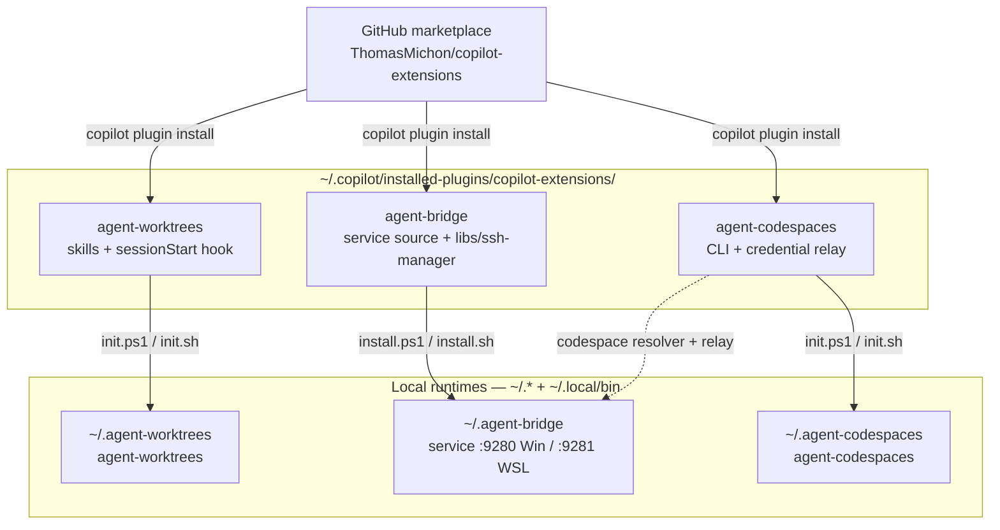
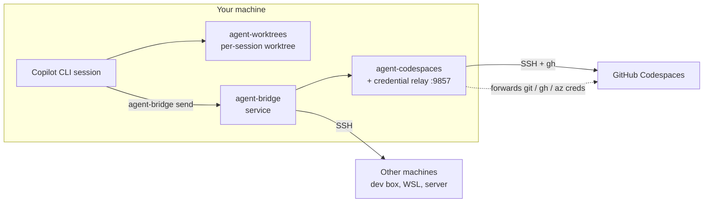
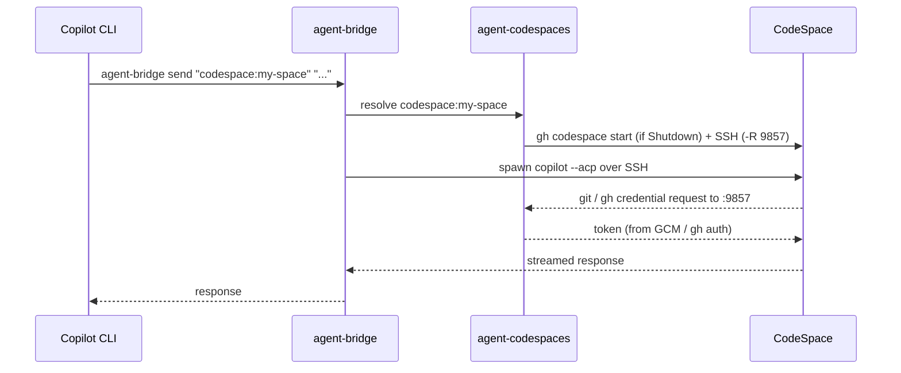

# copilot-extensions

A [Copilot CLI](https://docs.github.com/copilot/how-tos/use-copilot-agents/use-copilot-cli)
plugin suite that gives every session its **own isolated git worktree** and lets
your agents **talk to each other** — across worktrees, across machines, and into
**GitHub Codespaces** — with credentials forwarded securely along the way.

Three plugins, one marketplace. Install what you need; they compose.

| Plugin | Type | What it gives you |
|--------|------|-------------------|
| [agent-worktrees](plugins/agent-worktrees/) | Session tool | Each Copilot CLI session runs in its own git worktree — no branch conflicts, no stale state. Install this first. |
| [agent-bridge](plugins/agent-bridge/) | Persistent service | Send prompts to agents on other machines (or other worktrees) over an always-on local service + SSH mesh. |
| [agent-codespaces](plugins/agent-codespaces/) | CLI + relay | Create/manage GitHub Codespaces, address them as bridge agents (`codespace:<name>`), and forward git/GitHub/Azure credentials into them. |

All three support **Windows** and **Linux/WSL** (macOS planned).

---

## Architecture at a glance

Everything installs **from the marketplace** and runs **from local install
paths** (`~/.agent-*` + `~/.local/bin`) — no git checkout required at runtime.



How the pieces relate at run time:



---

## Quick Start

> Goal: from a fresh machine to *"send a prompt to my CodeSpace and get work
> done"* in a handful of steps. New to this? Read
> [Concepts](#concepts-the-control-harness-repo) first.

### Prerequisites

- **Copilot CLI** (`copilot` on PATH) · **Python 3.10+** · **Git 2.15+**
- **gh CLI**, authenticated (`gh auth login`) — for agent-codespaces
- **uv** (bootstrapped automatically by the init scripts if missing)

### 1. Install all three plugins

```bash
copilot plugin marketplace add ThomasMichon/copilot-extensions
copilot plugin install agent-worktrees@copilot-extensions
copilot plugin install agent-bridge@copilot-extensions
copilot plugin install agent-codespaces@copilot-extensions
```

### 2. Bootstrap the runtimes

Start a Copilot CLI session and say **"set up copilot extensions"** — the
[`copilot-extensions-setup`](plugins/agent-worktrees/skills/copilot-extensions-setup/SKILL.md)
skill runs each installer so the runtimes land under `~/.agent-*` with binstubs
in `~/.local/bin`. (Prefer to do it by hand? See each plugin's Getting Started,
linked below.)

Verify:

```bash
agent-worktrees --version
agent-bridge version && agent-bridge status
agent-codespaces version
```

### 3. Adopt your control-harness repo

Adopt your control repo (see [Concepts](#concepts-the-control-harness-repo)) so
worktrees, topology, and Codespaces all read from one place:

```bash
cd /path/to/my-control-harness
agent-worktrees register my-control-harness          # worktree sessions + binstub
agent-bridge config adopt --repo . --profile my-control-harness
agent-codespaces config adopt
```

### 4. First send — local, then CodeSpace

```bash
# Talk to a local agent (no SSH needed)
agent-bridge send local "Print the working directory and git branch."

# Talk to a CodeSpace through the bridge (auto-starts it; creds forwarded)
agent-codespaces bridge register
agent-bridge send "codespace:<name>" "Run: pwd && git rev-parse --abbrev-ref HEAD && gh auth status"
```

---

## Concepts: the control-harness repo

A **control-harness repo** is your own repo (a dotfiles-style "hub") that drives
the whole system. In examples it's called `my-control-harness`. It:

- is **adopted by agent-worktrees** (gets a project binstub + worktree root),
- holds the **topology** the bridge reads — `machines.yaml` (machines + SSH) and
  `acp-agents.json` (agents), plus `codespaces.yaml` (Codespace defaults +
  credential-relay policy), and
- doubles as the **Codespaces dotfiles repo**, so the same repo provisions each
  CodeSpace.

One repo, one source of truth, three plugins reading from it.

---

## Usage flow: a CodeSpace session end-to-end



The credential relay (port **9857**) means the CodeSpace authenticates to GitHub
and Azure DevOps using **your host's** credentials — no PATs baked into the
CodeSpace.

---

## Updating

```bash
# Pull the latest plugin from the marketplace…
copilot plugin update agent-worktrees@copilot-extensions

# …or update the plugin + runtime in one step
agent-worktrees update
```

agent-worktrees also auto-updates its runtime on session launch. agent-bridge
and agent-codespaces update via their installers (`scripts/install.* update`).

---

## Documentation

### Guides & component breakdowns

| Document | What's inside |
|----------|---------------|
| [Architecture overview](docs/architecture.md) | How the three plugins fit together: install topology, runtimes, ports, credential relay |
| [Rollout plan](docs/plans/rollout-readiness.md) | Onboarding-readiness plan and fixes |
| [Fresh dev box validation](docs/plans/fresh-devbox-validation.md) | Step-by-step validation on a clean machine |

### Agent Worktrees

| Document | Description |
|----------|-------------|
| [README](plugins/agent-worktrees/README.md) | Plugin overview |
| [Getting Started](plugins/agent-worktrees/docs/getting-started.md) | Install, adopt a repo, launch sessions |
| [Architecture](plugins/agent-worktrees/docs/architecture.md) | Plugin/runtime layers, session lifecycle |
| [CLI Reference](plugins/agent-worktrees/docs/cli-reference.md) | Commands, installer actions, config format |

### Agent Bridge

| Document | Description |
|----------|-------------|
| [README](plugins/agent-bridge/README.md) | Plugin overview |
| [Getting Started](plugins/agent-bridge/docs/getting-started.md) | Install, configure, start the service |
| [Architecture](plugins/agent-bridge/docs/architecture.md) | Service design, API reference, deployment |
| [Machine Configuration](plugins/agent-bridge/docs/machine-config.md) | Topology — `machines.yaml`, `acp-agents.json` |

### Agent Codespaces

| Document | Description |
|----------|-------------|
| [README](plugins/agent-codespaces/README.md) | Plugin overview, CLI reference, config format |
| [codespaces-setup](plugins/agent-codespaces/skills/codespaces-setup/SKILL.md) | First-time setup, adoption, credential relay config |
| [codespaces-lifecycle](plugins/agent-codespaces/skills/codespaces-lifecycle/SKILL.md) | Day-to-day ops — SSH, listing, bridge integration |

### Contributing

| Document | Description |
|----------|-------------|
| [CONTRIBUTING](CONTRIBUTING.md) | Versioning, release workflow, deployment pipeline |
| [AGENTS](AGENTS.md) | Repo development guide |

## License

[MIT](LICENSE)
