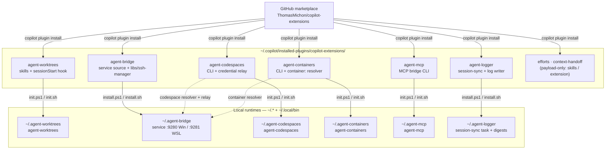
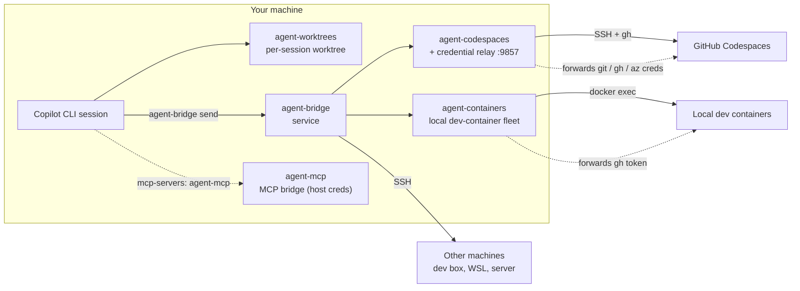
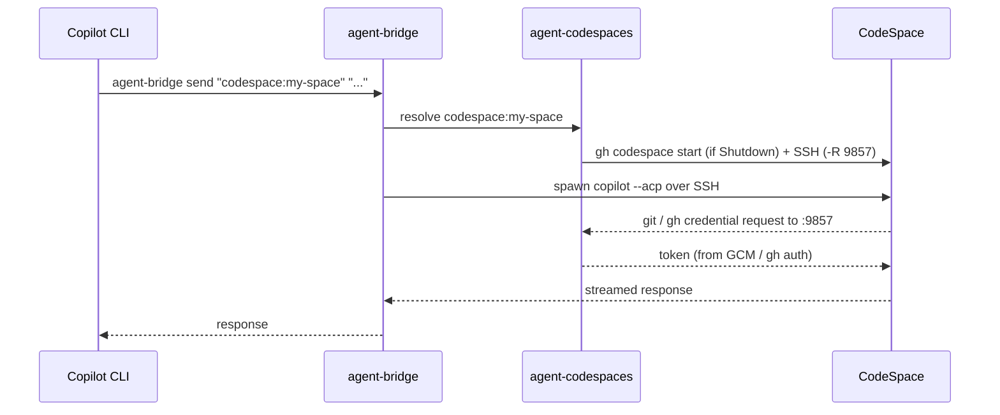

# copilot-extensions

A [Copilot CLI](https://docs.github.com/copilot/how-tos/use-copilot-agents/use-copilot-cli)
plugin suite that gives every session its **own isolated git worktree** and lets
your agents **talk to each other** — across worktrees, across machines, and into
**GitHub Codespaces** and **local dev containers** — with credentials forwarded
securely along the way. A fifth plugin wraps authenticated **MCP servers** so
those same host credentials reach your tools.

Plugins, one marketplace. Install what you need; they compose.

| Plugin | Type | What it gives you |
|--------|------|-------------------|
| [agent-worktrees](plugins/agent-worktrees/) | Session tool | Each Copilot CLI session runs in its own git worktree — no branch conflicts, no stale state. Install this first. |
| [agent-bridge](plugins/agent-bridge/) | Persistent service | Send prompts to agents on other machines (or other worktrees) over an always-on local service + SSH mesh. |
| [agent-codespaces](plugins/agent-codespaces/) | CLI + relay | Create/manage GitHub Codespaces, address them as bridge agents (`codespace:<name>`), and forward git/GitHub/Azure credentials into them. |
| [agent-containers](plugins/agent-containers/) | CLI + resolver | Manage a fleet of local Docker dev containers, borrow/release them per effort, and address them as bridge agents (`container:<name>`). |
| [agent-mcp](plugins/agent-mcp/) | MCP bridge | Wrap an upstream MCP server (HTTP or stdio) as a local stdio MCP and inject host credentials (Entra/`az`, `gh`, git-credential, env). Standalone — used directly from an agent's `mcp-servers` config. |
| [efforts](plugins/efforts/) | Planning skills | Plan a stretch of work as an **effort** — a folder with a README-as-shared-contract (premise + plan + journal) that humans and agents coordinate through. The executor plugins above bind its participant seam. |
| [agent-logger](plugins/agent-logger/) | Session logging | Turn raw Copilot sessions into structured Markdown logs — a segmenter, a voice-neutral log-writer agent, and a `session-sync` step that pushes session data to a configurable target (local / OneDrive / SSH / ingest). Personality is injected by the host, never built in. |
| [context-handoff](plugins/context-handoff/) | Extension + skill | Watch the context window via a session extension and, before it fills, compose a continuation prompt so a fresh session can resume the work. Payload-only — no runtime to install. |

All support **Windows** and **Linux/WSL** (macOS planned).

---

## Architecture at a glance

Eight plugins, one marketplace. **Six ship a runtime** (a `uv`-built venv under
`~/.agent-*` + a `~/.local/bin` binstub, deployed by the plugin's own
installer); **two are payload-only** — `efforts` (skills) and `context-handoff`
(a session extension) need no install beyond enabling the plugin. Everything
installs **from the marketplace** and runs **from local install paths** — no git
checkout required at runtime.



Each runtime plugin is itself a **Python package** (its `src/` plus vendored
`libs/`); the installer creates the venv with `uv venv` and installs the package
with `uv pip install <plugin_dir>`. See
[Quick Start](#quick-start) and [Architecture overview](docs/architecture.md)
for the payload-vs-runtime split.


How the pieces relate at run time:



---

## Quick Start

> Goal: from a fresh machine to *"send a prompt to my CodeSpace and get work
> done"* in a handful of steps. New to this? Read
> [Concepts](#concepts-the-control-harness-repo) first.

### Prerequisites

- **Copilot CLI** (`copilot` on PATH) · **Python 3.10+** · **Git 2.15+**
- **gh CLI**, authenticated (`gh auth login`) — for agent-codespaces and agent-containers
- **Docker** (Docker Desktop WSL2 backend) — for agent-containers only
- **uv** (bootstrapped automatically by the init scripts if missing)

### 1. Install the plugins

Install agent-worktrees first; add the others as you need them. The bridge
installer imports agent-codespaces and agent-containers for their `codespace:` /
`container:` resolvers, so install those **before** agent-bridge.

```bash
copilot plugin marketplace add ThomasMichon/copilot-extensions
copilot plugin install agent-worktrees@copilot-extensions
copilot plugin install agent-codespaces@copilot-extensions
copilot plugin install agent-containers@copilot-extensions
copilot plugin install agent-bridge@copilot-extensions
copilot plugin install agent-mcp@copilot-extensions      # optional, standalone
copilot plugin install agent-logger@copilot-extensions   # optional — session logging
copilot plugin install efforts@copilot-extensions        # optional — planning skills (no runtime)
copilot plugin install context-handoff@copilot-extensions # optional — context-window handoff (no runtime)
```

Each `copilot plugin install` only vendors the plugin's **payload** (source,
skills, hooks, extensions). The six runtime plugins (everything except `efforts`
and `context-handoff`) then need their runtime deployed once — that's Step 2,
which runs each installer to build a `uv` venv under `~/.agent-*` and drop a
binstub in `~/.local/bin`.

### 2. Bootstrap the runtimes

Start a Copilot CLI session and say **"set up copilot extensions"** — the
[`copilot-extensions-setup`](plugins/agent-worktrees/skills/copilot-extensions-setup/SKILL.md)
skill runs each installer so the runtimes land under `~/.agent-*` with binstubs
in `~/.local/bin`. (Prefer to do it by hand? See each plugin's Getting Started,
linked below.)

Verify:

```bash
agent-worktrees --version
agent-bridge version && agent-bridge status
agent-codespaces version
```

### 3. Adopt your control-harness repo

Adopt your control repo (see [Concepts](#concepts-the-control-harness-repo)) so
worktrees, topology, and Codespaces all read from one place:

```bash
cd /path/to/my-control-harness
agent-worktrees register my-control-harness          # worktree sessions + binstub
agent-bridge config adopt --repo . --profile my-control-harness
agent-codespaces config adopt
```

### 4. First send — local, then CodeSpace

```bash
# Talk to a local agent (no SSH needed)
agent-bridge send local "Print the working directory and git branch."

# Talk to a CodeSpace through the bridge (auto-starts it; creds forwarded)
agent-codespaces bridge register
agent-bridge send "codespace:<name>" "Run: pwd && git rev-parse --abbrev-ref HEAD && gh auth status"
```

---

## Concepts: the control-harness repo

A **control-harness repo** is your own repo (a dotfiles-style "hub") that drives
the whole system. In examples it's called `my-control-harness`. It:

- is **adopted by agent-worktrees** (gets a project binstub + worktree root),
- holds the **topology** the bridge reads — `machines.yaml` (machines + SSH) and
  `acp-agents.json` (agents), plus `codespaces.yaml` (Codespace defaults +
  credential-relay policy) and `containers.yaml` (local dev-container fleet
  defaults), and
- doubles as the **Codespaces dotfiles repo**, so the same repo provisions each
  CodeSpace.

One repo, one source of truth, the mesh plugins reading from it. (agent-mcp is
standalone — its bridge configs are per-agent files, preferably in-repo via
`--config` for repo-scoped agents, or under `~/.agent-mcp/bridges/` for personal
ones; not the control repo.)

---

## Usage flow: a CodeSpace session end-to-end



The credential relay (port **9857**) means the CodeSpace authenticates to GitHub
and Azure DevOps using **your host's** credentials — no PATs baked into the
CodeSpace.

---

## Updating

```bash
# Pull the latest plugin from the marketplace…
copilot plugin update agent-worktrees@copilot-extensions

# …or update the plugin + runtime in one step
agent-worktrees update
```

agent-worktrees also auto-updates its runtime on session launch. agent-bridge
and agent-codespaces update via their installers (`scripts/install.* update`).
agent-containers and agent-mcp re-run their `scripts/init.*` (with `-Force` /
`--force`) to redeploy the runtime.

## Uninstalling / baseline reset

The installer-based plugins (agent-worktrees, agent-bridge, agent-codespaces)
provide an `uninstall` action that stops their **own managed processes** before
removing files — agent-bridge stops the daemon + credential relay, and
agent-codespaces closes its SSH ControlMaster connections — so no manual
process-killing is needed:

```bash
scripts/install.sh uninstall          # per-plugin (add --purge / --remove-config to wipe config)
```

agent-containers and agent-mcp are init-only (no installer): remove them by
deleting `~/.agent-containers` / `~/.agent-mcp` and their `~/.local/bin`
binstubs.

To return a machine to a clean baseline in one step (stops everything, removes
the installer-based runtimes, binstubs, the service/scheduled task, and config)
use the repo-level reset tool — it's idempotent and works even if the CLIs are
broken:

```powershell
# Windows
pwsh -File tools\reset.ps1                       # prompts; add -Yes to skip
pwsh -File tools\reset.ps1 -Yes -RemovePlugins   # also `copilot plugin uninstall`
```
```bash
# Linux/WSL
bash tools/reset.sh                              # prompts; add --yes to skip
bash tools/reset.sh --yes --remove-plugins
```

> The reset tool currently targets the installer-based runtimes
> (`~/.agent-worktrees`, `~/.agent-bridge`, `~/.agent-codespaces`); remove
> `~/.agent-containers` and `~/.agent-mcp` manually until it covers them.

Your source repos and their `.worktrees` content are never touched.

---

## Documentation

### Guides & component breakdowns

| Document | What's inside |
|----------|---------------|
| [Architecture overview](docs/architecture.md) | How the plugins fit together: install topology, runtimes, ports, credential relay |
| [Rollout plan](docs/plans/rollout-readiness.md) | Onboarding-readiness plan and fixes |
| [Fresh dev box validation](docs/plans/fresh-devbox-validation.md) | Step-by-step validation on a clean machine |

### Agent Worktrees

| Document | Description |
|----------|-------------|
| [README](plugins/agent-worktrees/README.md) | Plugin overview |
| [Getting Started](plugins/agent-worktrees/docs/getting-started.md) | Install, adopt a repo, launch sessions |
| [Architecture](plugins/agent-worktrees/docs/architecture.md) | Plugin/runtime layers, session lifecycle |
| [CLI Reference](plugins/agent-worktrees/docs/cli-reference.md) | Commands, installer actions, config format |

### Agent Bridge

| Document | Description |
|----------|-------------|
| [README](plugins/agent-bridge/README.md) | Plugin overview |
| [Getting Started](plugins/agent-bridge/docs/getting-started.md) | Install, configure, start the service |
| [Architecture](plugins/agent-bridge/docs/architecture.md) | Service design, API reference, deployment |
| [Machine Configuration](plugins/agent-bridge/docs/machine-config.md) | Topology — `machines.yaml`, `acp-agents.json` |

### Agent Codespaces

| Document | Description |
|----------|-------------|
| [README](plugins/agent-codespaces/README.md) | Plugin overview, CLI reference, config format |
| [codespaces-setup](plugins/agent-codespaces/skills/codespaces-setup/SKILL.md) | First-time setup, adoption, credential relay config |
| [codespaces-lifecycle](plugins/agent-codespaces/skills/codespaces-lifecycle/SKILL.md) | Day-to-day ops — SSH, listing, bridge integration |

### Agent Containers

| Document | Description |
|----------|-------------|
| [README](plugins/agent-containers/README.md) | Plugin overview, CLI reference, config format, discovery |
| [containers-fleet](plugins/agent-containers/skills/containers-fleet/SKILL.md) | Fleet provisioning, borrow/release leases, `container:` dispatch |

### Agent MCP

| Document | Description |
|----------|-------------|
| [README](plugins/agent-mcp/README.md) | Plugin overview, bridge config format, auth kinds, CLI |
| [agent-mcp](plugins/agent-mcp/skills/agent-mcp/SKILL.md) | Defining a bridge, wiring it into an agent's `mcp-servers` |

### Efforts

| Document | Description |
|----------|-------------|
| [README](plugins/efforts/README.md) | Plugin overview, the skill-governs-pattern + repo-addendum model |
| [planning-efforts](plugins/efforts/skills/planning-efforts/SKILL.md) | Start, plan, resume, archive efforts |
| [reference guide](plugins/efforts/skills/planning-efforts/references/efforts.md) | Full effort schema, lifecycle, participants seam |
| [efforts-setup](plugins/efforts/skills/efforts-setup/SKILL.md) | Adopt efforts in a repo: scaffold + write the addendum |

### Agent Logger

| Document | Description |
|----------|-------------|
| [README](plugins/agent-logger/README.md) | Plugin overview, pipeline pieces, design principles |
| [log-session](plugins/agent-logger/skills/log-session/SKILL.md) | Write a log for one session on demand |
| [process-backlog](plugins/agent-logger/skills/process-backlog/SKILL.md) | Batch-log a backlog of unlogged sessions locally |
| [session-sync-setup](plugins/agent-logger/skills/session-sync-setup/SKILL.md) | Configure + deploy session-sync (target, schedule) |

### Context Handoff

| Document | Description |
|----------|-------------|
| [README](plugins/context-handoff/README.md) | Plugin overview, why an extension, no-install delivery |
| [context-handoff](plugins/context-handoff/skills/context-handoff/SKILL.md) | The `/handoff` continuation-prompt workflow |
| [context-handoff-setup](plugins/context-handoff/skills/context-handoff-setup/SKILL.md) | Enable the plugin extension in a repo |

### Contributing

| Document | Description |
|----------|-------------|
| [CONTRIBUTING](CONTRIBUTING.md) | Versioning, release workflow, deployment pipeline |
| [AGENTS](AGENTS.md) | Repo development guide |

## License

[MIT](LICENSE)
