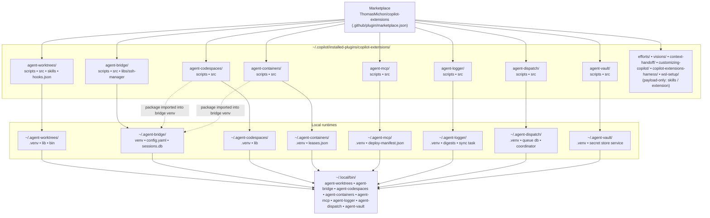
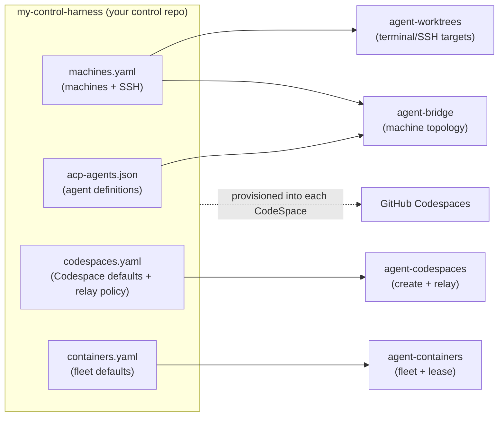
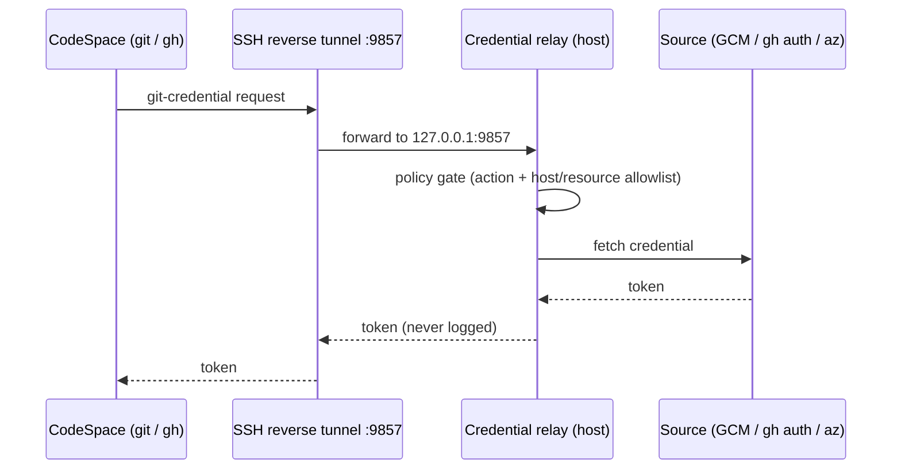
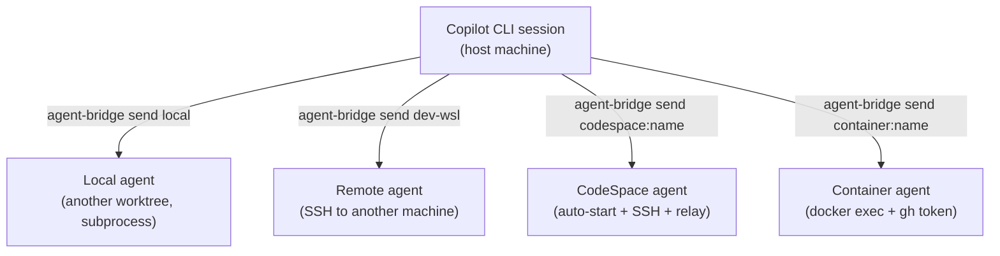

# Architecture Overview

How the fourteen copilot-extensions plugins fit together — install topology,
runtimes, ports, and the credential relay. **Eight ship a runtime** (a `uv`-built
venv under `~/.agent-*` plus a `~/.local/bin` binstub, deployed by the plugin's
own installer); **six are payload-only** — `efforts` (skills), `visions`
(skills), `context-handoff` (a session extension), `customizing-copilot`
(skills), `copilot-extensions-harness` (skills), and `wsl-setup` (skills) deploy
entirely from the marketplace payload with no installer. For per-plugin
internals, follow the links in each section.

## The plugins

### Runtime plugins (installer-deployed venv + binstub)

| Plugin | Kind | Runtime home | Binstub | Lifecycle |
|--------|------|--------------|---------|-----------|
| [agent-worktrees](../plugins/agent-worktrees/) | Session plugin (skills + `sessionStart` hook) | `~/.agent-worktrees/` | `~/.local/bin/agent-worktrees` + per-project binstubs | Per session (launched by binstub); runtime auto-updates on session start |
| [agent-bridge](../plugins/agent-bridge/) | Persistent HTTP service | `~/.agent-bridge/` | `~/.local/bin/agent-bridge` | Always-on daemon (Windows scheduled task / Linux systemd user unit) |
| [agent-codespaces](../plugins/agent-codespaces/) | CLI + credential relay | `~/.agent-codespaces/` | `~/.local/bin/agent-codespaces` | On-demand CLI; relay + `codespace:` resolver run inside the agent-bridge service process |
| [agent-containers](../plugins/agent-containers/) | CLI + `container:` resolver | `~/.agent-containers/` | `~/.local/bin/agent-containers` | On-demand CLI; `container:` resolver runs inside the agent-bridge service process |
| [agent-mcp](../plugins/agent-mcp/) | Standalone MCP bridge (stdio) | `~/.agent-mcp/` | `~/.local/bin/agent-mcp` | Spawned per-call by an agent's `mcp-servers` entry; no bridge integration |
| [agent-logger](../plugins/agent-logger/) | Session-logging CLI + writer agent + sync task | `~/.agent-logger/` | `~/.local/bin/agent-logger` | On-demand CLI + a scheduled `session-sync` (Windows task / Linux systemd timer) |
| [agent-dispatch](../plugins/agent-dispatch/) | Task-queue engine + per-host coordinator + CLI/MCP | `~/.agent-dispatch/` | `~/.local/bin/agent-dispatch` | On-demand CLI + optional always-on coordinator (Windows task / Linux systemd unit) |
| [agent-vault](../plugins/agent-vault/) | Local secret store: CLI + vault service | `~/.agent-vault/` | `~/.local/bin/agent-vault` | On-demand CLI + a persistent vault daemon (Windows scheduled task / Linux systemd user unit); ships a `vault-askpass` SUDO_ASKPASS helper |

### Payload-only plugins (no installer, no runtime)

| Plugin | Kind | Deployed as | Lifecycle |
|--------|------|-------------|-----------|
| [efforts](../plugins/efforts/) | Planning skills (`planning-efforts`, `efforts-setup`) | Marketplace payload (skills + assets) | Loaded on demand when a skill matches; no runtime to install |
| [visions](../plugins/visions/) | North-star skills (`envisioning`, `visions-setup`) | Marketplace payload (skills + assets) | Loaded on demand when a skill matches; no runtime to install |
| [context-handoff](../plugins/context-handoff/) | Session **extension** + `/handoff` skill | Marketplace payload (`extensions/context-handoff/extension.mjs`) | Auto-discovered from the enabled plugin's `extensions/` dir; no copy to `~/.copilot/extensions/`, no deploy manifest |
| [customizing-copilot](../plugins/customizing-copilot/) | Customization skills (authoring skills, sub-agents, MCP servers, plugins, harnesses, review) | Marketplace payload (skills) | Loaded on demand when a CLI-customization prompt matches; no runtime to install |
| [copilot-extensions-harness](../plugins/copilot-extensions-harness/) | Operator-harness skills (`contributing-to-copilot-extensions`, `diagnosing-copilot-extensions`) | Marketplace payload (skills) | Loaded on demand when a work-on-this-repo prompt matches; no runtime to install |
| [wsl-setup](../plugins/wsl-setup/) | WSL2 setup / troubleshooting skills | Marketplace payload (skills) | Loaded on demand when a WSL-setup prompt matches; no runtime to install |

Every runtime plugin is itself a **Python package** — its `src/` package plus
any vendored `libs/` — installed by its own `scripts/install.*` / `scripts/init.*`
with `uv venv` + `uv pip install <plugin_dir>`. `copilot plugin install/update`
only moves the marketplace payload; the runtime venv/binstub/service is deployed
(and updated) by that installer step. The repo uses **`uv`/`uv pip`** throughout
— not `uvx`, `uv tool install`, or `pipx`. The full payload-vs-runtime contract
lives in [install-contract.md](install-contract.md).

## Install topology — marketplace to local paths

Each plugin is vendored by the Copilot CLI into `installed-plugins/`, then its
installer deploys a self-contained runtime under `~/.agent-*`. **At run time
nothing depends on a git checkout of this repo.**

> The `PO` node — `efforts`, `visions`, `context-handoff`, `customizing-copilot`,
> `copilot-extensions-harness`, and `wsl-setup` — deploys entirely from the
> marketplace payload — no installer, no `~/.agent-*` runtime, no binstub.

Key rule: the **agent-codespaces and agent-containers binstubs are owned by
their own runtimes** (`~/.agent-codespaces`, `~/.agent-containers`). The
agent-bridge installer also installs the `agent_codespaces` and
`agent_containers` *packages* into its own venv so the service can import the
`codespace:` / `container:` namespace resolvers (and, for codespaces, the
credential relay) — but it must not repoint those binstubs. This keeps one
canonical CLI per plugin and avoids version skew. agent-mcp is standalone: no
bridge import, no resolver — agents invoke its binstub directly.

## Ports

| Port | Owner | Purpose |
|------|-------|---------|
| **9280** (Windows) / **9281** (Linux/WSL) | agent-bridge | HTTP API the CLI talks to. Platform-split avoids a WSL2/Windows TCP collision. Use `agent-bridge status` to read the active port. |
| **9857** | agent-codespaces credential relay | TCP server the CodeSpace reaches over an SSH reverse tunnel (`-R 9857`) to fetch git/GitHub/Azure credentials. Starts with the bridge service. |

## The control-harness repo

A teammate's own repo (a dotfiles-style hub, `my-control-harness` in examples)
is the single source of truth the mesh plugins read from.

- `agent-worktrees register` → project binstub + worktree root.
- `agent-bridge config adopt` → a topology profile pointing at `machines.yaml`
  + `acp-agents.json`.
- `agent-codespaces config adopt` → registers the repo so `codespaces.yaml` is
  read live on every operation.
- `agent-containers` reads `containers.yaml` (resolved via
  `$AGENT_CONTAINERS_CONFIG`, `./containers.yaml`, or
  `~/.agent-containers/containers.yaml`) — keep it in the control repo to share
  fleet defaults.

> agent-mcp is **not** wired to the control repo — its bridge configs are
> per-agent files: preferably **in-repo** (`--config .github/agents/<name>.mcp.yaml`)
> for repo-scoped agents, or **user-global** under `~/.agent-mcp/bridges/<name>`
> for personal/cross-repo MCPs.

See [machine-config](../plugins/agent-bridge/docs/machine-config.md) for the
file formats and [codespaces-setup](../plugins/agent-codespaces/skills/codespaces-setup/SKILL.md)
for `codespaces.yaml`.

## Credential relay

The relay lets a CodeSpace authenticate to GitHub and Azure DevOps using **your
host's** credentials — no PATs stored in the CodeSpace. All requests pass a
policy gate (action allowlist + per-source host/resource allowlists).

| Source | Action | Backed by | Default |
|--------|--------|-----------|---------|
| `git-credential` | `get`/`store`/`erase` | local Git Credential Manager | on |
| `gh-auth` | `get-github-token` | `gh auth token` | on |
| `az-login` | `get-azure-token` | `az account get-access-token` | **off** (high-trust; opt-in) |

## Communication paths

- **Local** — no SSH; the bridge spawns a subprocess (optionally in a fresh
  worktree via the agent's `project`).
- **Remote** — SSH to a machine declared in `machines.yaml` with
  `ssh.ready: true`.
- **CodeSpace** — agent-codespaces resolves `codespace:<name>` (by raw **or**
  friendly/display name; the `codespace:` prefix is optional), auto-starts a
  Shutdown CodeSpace, opens SSH with the relay tunnel, and the bridge spawns
  `copilot --acp` inside it.
- **Container** — agent-containers resolves `container:<name>` to a leased local
  dev container, runs `copilot --acp` over `docker exec`, and forwards the host
  `gh auth token` (as `GH_TOKEN`) so the in-container agent is authenticated.

> **Note:** agent-mcp has no `agent-bridge send` path — it is not an inter-agent
> transport. It is wrapped directly by an agent's `mcp-servers` config to expose
> an authenticated upstream MCP server over local stdio.

## Where to go next

- [Rollout readiness plan](plans/rollout-readiness.md) · [Fresh dev box validation](plans/fresh-devbox-validation.md)
- agent-worktrees [architecture](../plugins/agent-worktrees/docs/architecture.md) · [CLI reference](../plugins/agent-worktrees/docs/cli-reference.md)
- agent-bridge [architecture](../plugins/agent-bridge/docs/architecture.md) · [machine-config](../plugins/agent-bridge/docs/machine-config.md)
- agent-codespaces [README](../plugins/agent-codespaces/README.md) · [lifecycle skill](../plugins/agent-codespaces/skills/codespaces-lifecycle/SKILL.md)
- agent-containers [README](../plugins/agent-containers/README.md) · [containers-fleet skill](../plugins/agent-containers/skills/containers-fleet/SKILL.md)
- agent-mcp [README](../plugins/agent-mcp/README.md) · [agent-mcp skill](../plugins/agent-mcp/skills/agent-mcp/SKILL.md)
- agent-logger [README](../plugins/agent-logger/README.md) · [session-sync-setup skill](../plugins/agent-logger/skills/session-sync-setup/SKILL.md)
- efforts [README](../plugins/efforts/README.md) · [planning-efforts skill](../plugins/efforts/skills/planning-efforts/SKILL.md)
- context-handoff [README](../plugins/context-handoff/README.md) · [context-handoff skill](../plugins/context-handoff/skills/context-handoff/SKILL.md)
- customizing-copilot [README](../plugins/customizing-copilot/README.md) · [authoring-skills](../plugins/customizing-copilot/skills/authoring-skills/SKILL.md) · [defining-subagents](../plugins/customizing-copilot/skills/defining-subagents/SKILL.md) · [registering-mcp-servers](../plugins/customizing-copilot/skills/registering-mcp-servers/SKILL.md) · [installing-plugins](../plugins/customizing-copilot/skills/installing-plugins/SKILL.md)
