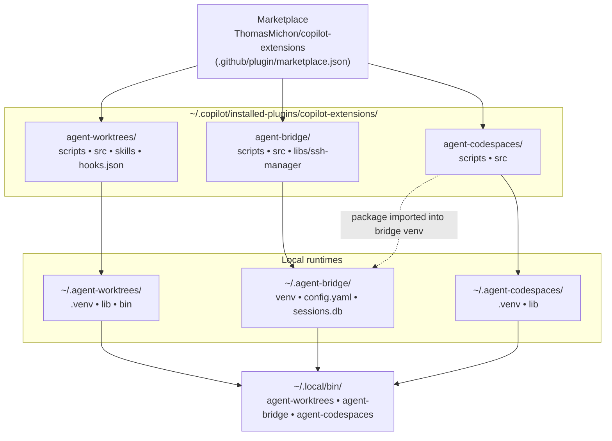
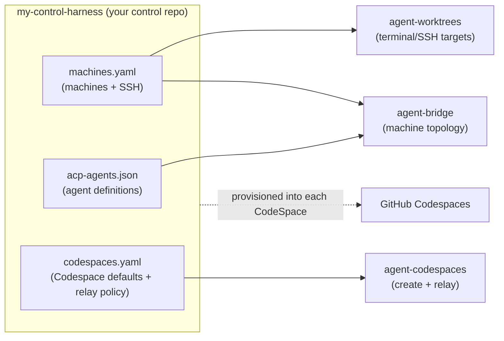
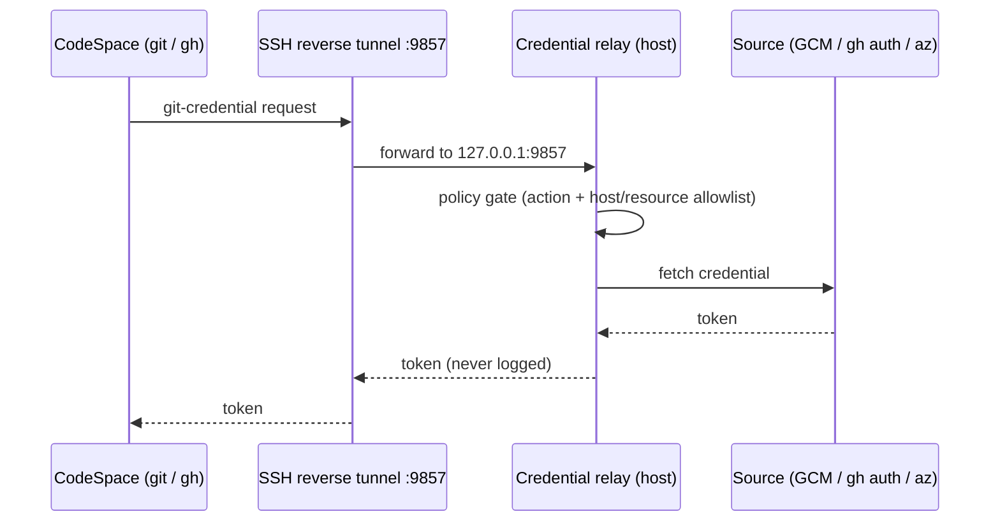
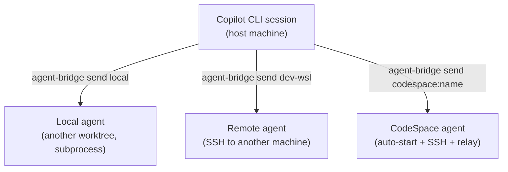

# Architecture Overview

How the three copilot-extensions plugins fit together — install topology,
runtimes, ports, and the credential relay. For per-plugin internals, follow the
links in each section.

## The three plugins

| Plugin | Kind | Runtime home | Binstub | Lifecycle |
|--------|------|--------------|---------|-----------|
| [agent-worktrees](../plugins/agent-worktrees/) | Session plugin (skills + `sessionStart` hook) | `~/.agent-worktrees/` | `~/.local/bin/agent-worktrees` + per-project binstubs | Per session (launched by binstub); runtime auto-updates on session start |
| [agent-bridge](../plugins/agent-bridge/) | Persistent HTTP service | `~/.agent-bridge/` | `~/.local/bin/agent-bridge` | Always-on daemon (Windows scheduled task / Linux systemd user unit) |
| [agent-codespaces](../plugins/agent-codespaces/) | CLI + credential relay | `~/.agent-codespaces/` | `~/.local/bin/agent-codespaces` | On-demand CLI; relay runs inside the agent-bridge service process |

## Install topology — marketplace to local paths

Each plugin is vendored by the Copilot CLI into `installed-plugins/`, then its
installer deploys a self-contained runtime under `~/.agent-*`. **At run time
nothing depends on a git checkout of this repo.**

Key rule: the **agent-codespaces binstub is owned by `~/.agent-codespaces`**.
The agent-bridge installer also installs the `agent_codespaces` *package* into
its own venv so the service can import the `codespace:` namespace resolver and
the credential relay — but it must not repoint the binstub. This keeps one
canonical CLI and avoids version skew.

## Ports

| Port | Owner | Purpose |
|------|-------|---------|
| **9280** (Windows) / **9281** (Linux/WSL) | agent-bridge | HTTP API the CLI talks to. Platform-split avoids a WSL2/Windows TCP collision. Use `agent-bridge status` to read the active port. |
| **9857** | agent-codespaces credential relay | TCP server the CodeSpace reaches over an SSH reverse tunnel (`-R 9857`) to fetch git/GitHub/Azure credentials. Starts with the bridge service. |

## The control-harness repo

A teammate's own repo (a dotfiles-style hub, `my-control-harness` in examples)
is the single source of truth all three plugins read from.

- `agent-worktrees register` → project binstub + worktree root.
- `agent-bridge config adopt` → a topology profile pointing at `machines.yaml`
  + `acp-agents.json`.
- `agent-codespaces config adopt` → registers the repo so `codespaces.yaml` is
  read live on every operation.

See [machine-config](../plugins/agent-bridge/docs/machine-config.md) for the
file formats and [codespaces-setup](../plugins/agent-codespaces/skills/codespaces-setup/SKILL.md)
for `codespaces.yaml`.

## Credential relay

The relay lets a CodeSpace authenticate to GitHub and Azure DevOps using **your
host's** credentials — no PATs stored in the CodeSpace. All requests pass a
policy gate (action allowlist + per-source host/resource allowlists).

| Source | Action | Backed by | Default |
|--------|--------|-----------|---------|
| `git-credential` | `get`/`store`/`erase` | local Git Credential Manager | on |
| `gh-auth` | `get-github-token` | `gh auth token` | on |
| `az-login` | `get-azure-token` | `az account get-access-token` | **off** (high-trust; opt-in) |

## Communication paths

- **Local** — no SSH; the bridge spawns a subprocess (optionally in a fresh
  worktree via the agent's `project`).
- **Remote** — SSH to a machine declared in `machines.yaml` with
  `ssh.ready: true`.
- **CodeSpace** — agent-codespaces resolves `codespace:<name>`, auto-starts a
  Shutdown CodeSpace, opens SSH with the relay tunnel, and the bridge spawns
  `copilot --acp` inside it.

## Where to go next

- [Rollout readiness plan](plans/rollout-readiness.md) · [Fresh dev box validation](plans/fresh-devbox-validation.md)
- agent-worktrees [architecture](../plugins/agent-worktrees/docs/architecture.md) · [CLI reference](../plugins/agent-worktrees/docs/cli-reference.md)
- agent-bridge [architecture](../plugins/agent-bridge/docs/architecture.md) · [machine-config](../plugins/agent-bridge/docs/machine-config.md)
- agent-codespaces [README](../plugins/agent-codespaces/README.md) · [lifecycle skill](../plugins/agent-codespaces/skills/codespaces-lifecycle/SKILL.md)
