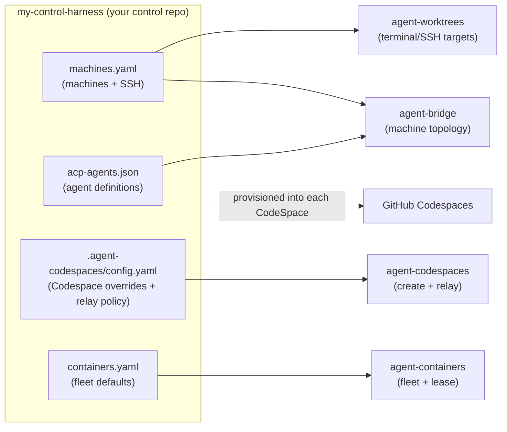
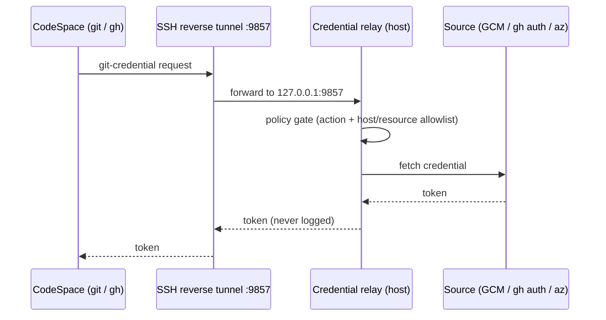
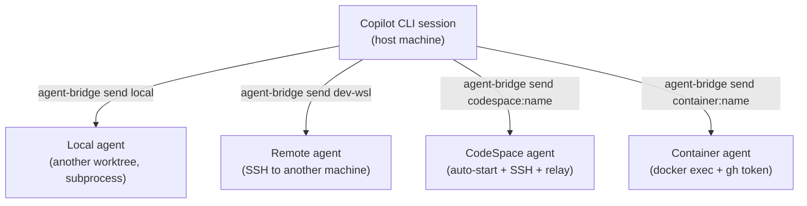

# Architecture Overview

How the 22 copilot-extensions plugins fit together — install topology,
runtimes, ports, and the credential relay. **Twelve ship a runtime** (currently
a `uv`-built venv under a plugin-owned root such as `~/.agent-*` or
`~/.budget-guidance`, deployed by the plugin's own installer) plus generated
payload-local agent commands and session command glossaries; compatibility
management wrappers remain in `~/.local/bin` during the installation-cell
migration. **Ten are payload-only** — `efforts` (skills), `visions`
(skills), `context-handoff` (hook + session extension + skill), `customizing-copilot`
(skills), `copilot-extensions-harness` (skills + contribution-boundary hook),
`wsl-setup` (skills), and
`harness-knowledge` (skills), `ai-attribution` (hook + skill), and
`delegation-guidance` (hook + skill), and `context-injection` (aggregation hook)
deploy entirely from the marketplace
payload with no installer. For per-plugin internals, follow the links in each
section.

## The plugins

### Runtime plugins (installer-deployed runtime + payload-local commands)

| Plugin | Kind | Legacy runtime home | Global command surface (legacy wrapper / project binstubs) | Lifecycle |
|--------|------|--------------|---------|-----------|
| [agent-worktrees](../plugins/agent-worktrees/) | Session plugin (skills + `sessionStart` hook) | `~/.agent-worktrees/` | `~/.local/bin/agent-worktrees` + per-project binstubs | Per session (launched by binstub); runtime auto-updates on session start |
| [agent-bridge](../plugins/agent-bridge/) | Persistent HTTP service | `~/.agent-bridge/` | `~/.local/bin/agent-bridge` | Always-on daemon (Windows scheduled task / Linux systemd user unit) |
| [agent-codespaces](../plugins/agent-codespaces/) | CLI + credential relay | `~/.agent-codespaces/` | `~/.local/bin/agent-codespaces` | On-demand CLI; self-registers a `codespace:` namespace **provider** (+ credential relay) with the agent-bridge daemon via a `~/.agent-bridge/providers.d/` manifest — the daemon drives its binstub over a process boundary |
| [agent-containers](../plugins/agent-containers/) | CLI + `container:` provider | `~/.agent-containers/` | `~/.local/bin/agent-containers` | On-demand CLI; self-registers a `container:` namespace **provider** with the agent-bridge daemon via a `~/.agent-bridge/providers.d/` manifest (process-boundary binstub invocation) |
| [agent-mcp](../plugins/agent-mcp/) | Standalone MCP bridge (stdio) | `~/.agent-mcp/` | `~/.local/bin/agent-mcp` | Spawned per-call by an agent's `mcp-servers` entry; no bridge integration |
| [agent-ssh](../plugins/agent-ssh/) | SSH profile emitter + verifier | `~/.agent-ssh/` | `~/.local/bin/agent-ssh` | On-demand CLI; owns the transport-provider contract for SSH profile modules |
| [agent-logger](../plugins/agent-logger/) | Session-logging CLI + writer agent + local/rescue sync sources | `~/.agent-logger/` | `~/.local/bin/agent-logger` | On-demand CLI + a scheduled `session-sync` (Windows task / Linux systemd timer) |
| [agent-dispatch](../plugins/agent-dispatch/) | Task-queue engine + per-host coordinator + CLI/MCP | `~/.agent-dispatch/` | `~/.local/bin/agent-dispatch` | On-demand CLI + optional always-on coordinator and label-gated embody supervisor(s) (Windows tasks / Linux systemd units) |
| [agent-index](../plugins/agent-index/) | Lightweight retrieval CLI + managed host companion | `~/.agent-index/` (client and durable data); dispatch-owned host generations | `~/.local/bin/agent-index` | Explicit configured host service supervised and provisioned only by running agent-dispatch; independent warm engine unchanged |
| [agent-machines](../plugins/agent-machines/) | Machine-state reconciler CLI | `~/.agent-machines/` | `~/.local/bin/agent-machines` | On-demand CLI (no daemon); reconciled at session launch on its gated machines |
| [agent-vault](../plugins/agent-vault/) | Local secret store: CLI + vault service | `~/.agent-vault/` | `~/.local/bin/agent-vault` | On-demand CLI + a persistent vault daemon (Windows scheduled task / Linux systemd user unit); ships a `vault-askpass` SUDO_ASKPASS helper |
| [budget-guidance](../plugins/budget-guidance/) | Current budget-posture CLI | `~/.budget-guidance/` | `~/.local/bin/budget-guidance` | On-demand CLI; static configuration is offline and default-off |

### Payload-only plugins (no installer, no runtime)

| Plugin | Kind | Deployed as | Lifecycle |
|--------|------|-------------|-----------|
| [efforts](../plugins/efforts/) | Planning skills (`planning-efforts`, `efforts-setup`) | Marketplace payload (skills + assets) | Loaded on demand when a skill matches; no runtime to install |
| [visions](../plugins/visions/) | North-star skills (`envisioning`, `visions-setup`) | Marketplace payload (skills + assets) | Loaded on demand when a skill matches; no runtime to install |
| [context-handoff](../plugins/context-handoff/) | Ambient continuity hook + session **extension** + `/handoff` skill | Marketplace payload (hook, scripts, extension, and skill) | Hook injects a concise owner-marked continuity kernel; extension is auto-discovered from the enabled plugin's `extensions/` dir; no copy to `~/.copilot/extensions/`, no deploy manifest |
| [customizing-copilot](../plugins/customizing-copilot/) | Customization and CLI-diagnostics skills (authoring skills, sub-agents, MCP servers, plugins, harnesses, review, startup hangs) | Marketplace payload (skills) | Loaded on demand when a CLI customization or startup-diagnostics prompt matches; no runtime to install |
| [copilot-extensions-harness](../plugins/copilot-extensions-harness/) | Operator-harness skills, `clean-room-judge` evaluator agent, and ambient contribution-boundary pointer | Marketplace payload (skills + agent + `sessionStart` hook) | Hook emits a concise guide pointer at session start; detailed skills/agent load on demand; no runtime to install |
| [wsl-setup](../plugins/wsl-setup/) | WSL2 setup / troubleshooting skills | Marketplace payload (skills) | Loaded on demand when a WSL-setup prompt matches; no runtime to install |
| [harness-knowledge](../plugins/harness-knowledge/) | Stateless-harness → knowledge-repo binding skill (`binding-knowledge`) | Marketplace payload (skill + configurator script) | Loaded on demand when a harness-setup prompt matches; no runtime to install |
| [ai-attribution](../plugins/ai-attribution/) | Ambient publication-policy hook + publication/setup skills | Marketplace payload (hooks + dependency-free scripts + skills/docs/examples) | The hook emits a concise payload-cwd-gated policy kernel at session start; setup reconciles the static fallback; detailed publication workflow loads on demand; no runtime to install |
| [delegation-guidance](../plugins/delegation-guidance/) | Ambient coordinator-first routing hook + `delegating-work` skill | Marketplace payload (hook + scripts + skill) | The hook emits a concise owner-marked kernel at session start; detailed routing loads on demand; no runtime to install |
| [context-injection](../plugins/context-injection/) | Compatibility session-context aggregator | Marketplace payload (hook + scripts + contributor schema) | On affected hosts, verifies one exact source-qualified marketplace authority, trust, compatible engine, complete declarations, and aggregate admission before emitting; otherwise every authority-aware producer preserves its standalone path |

Every runtime plugin is itself a **Python package** — its `src/` package plus
any vendored `libs/` — installed by its own `scripts/install.*` / `scripts/init.*`
with `uv venv` + `uv pip install <plugin_dir>`. `copilot plugin install/update`
only moves the marketplace payload; the runtime venv, compatibility management
wrapper, and service are deployed (and updated) by that installer step. The
payload-local agent shims move with the payload itself. The repo uses
**`uv`/`uv pip`** throughout
— not `uvx`, `uv tool install`, or `pipx`. The full payload-vs-runtime contract
lives in [install-contract.md](install-contract.md).

Agent Index's optional host `[store]` footprint is the narrow
[managed companion](patterns/managed-companion-runtime.md) exception: its own
installer provisions only the lightweight base/client package. The running
dispatch supervisor consumes an attributed declaration to build and select
immutable host generations; plugin commands and session hooks cannot install
or launch that host. Namespaced host integration is not yet supported.

Every runtime `agent-*` plugin also carries `payload-invocation.json`, generated
POSIX/PowerShell/CMD shims under its payload `bin/` or manifest `outputDir`, and
an `emit-command-catalog` pure contributor. `agent-worktrees` is the first
[`session-scoped-dynamic-guidance`](patterns/session-scoped-dynamic-guidance.md)
exemplar: its payload-local `sessionStart` hook writes the attributable command
catalog and current binding to the exact session's instruction folder, while
its existing authority-aware contributor remains a best-effort supplementary
channel. Agent-facing skills resolve logical commands through that attributable
session glossary rather than ambient `PATH`.
`~/.local/bin/agent-*` remains a legacy management compatibility surface while
runtime roots are still unqualified; repo/project binstubs remain the intended
machine-global command surface.

The repository now also carries the non-operative
`libs/installer-readiness/` foundation for a later out-of-plugin configurator.
It defines plugin-owned installer/readiness metadata, joins enabled settings to
validated marketplace installation-cell receipts, and produces a validated
dependency plan without executing it. No runtime plugin publishes an adapter in
this slice, and no central orchestrator is introduced; each plugin's existing
self-provisioning path remains independent and authoritative.

## Install topology — marketplace to local paths

Each plugin is vendored by the Copilot CLI into `installed-plugins/`, then its
installer deploys a self-contained runtime under `~/.agent-*`. **At run time
nothing depends on a git checkout of this repo.**

```mermaid
flowchart TB
    MP["Marketplace<br/>ThomasMichon/copilot-extensions<br/>(.github/plugin/marketplace.json)"]
    subgraph IP["~/.copilot/installed-plugins/copilot-extensions/"]
      direction LR
      AW["agent-worktrees/<br/>scripts • src • skills • hooks.json"]
      AB["agent-bridge/<br/>scripts • src • libs/ssh-manager"]
      AC["agent-codespaces/<br/>scripts • src"]
      AN["agent-containers/<br/>scripts • src"]
      AM["agent-mcp/<br/>scripts • src"]
      AS["agent-ssh/<br/>scripts • src • contract"]
      AL["agent-logger/<br/>scripts • src"]
      AD["agent-dispatch/<br/>scripts • src"]
      AV["agent-vault/<br/>scripts • src"]
      AI["agent-index/<br/>scripts • src"]
      AK["agent-machines/<br/>scripts • src"]
      PO["efforts/ • visions/ • context-handoff/ • customizing-copilot/ • copilot-extensions-harness/ • wsl-setup/ • harness-knowledge/ • ai-attribution/ • delegation-guidance/ • context-injection/<br/>(payload-only: skills / hooks / extension)"]
    end
    subgraph RT["Local runtimes"]
      RW["~/.agent-worktrees/<br/>versions/ • current-version • bin"]
      RB["~/.agent-bridge/<br/>versions/ • current-version • config.yaml • sessions.db"]
      RC["~/.agent-codespaces/<br/>versions/ • current-version"]
      RN["~/.agent-containers/<br/>versions/ • current-version • leases/holds • rescues"]
      RM["~/.agent-mcp/<br/>versions/ • current-version • deploy-manifest.json"]
      RS["~/.agent-ssh/<br/>versions/ • current-version • deploy-manifest.json"]
      RL["~/.agent-logger/<br/>versions/ • current-version • digests • sync task"]
      RD["~/.agent-dispatch/<br/>versions/ • current-version • queue db • coordinator • supervisor profiles"]
      RV["~/.agent-vault/<br/>versions/ • current-version • secret store service"]
      RI["~/.agent-index/<br/>versions/ • current-version • service + engine"]
      RK["~/.agent-machines/<br/>versions/ • current-version"]
    end
    CAT["sessionStart command glossaries<br/>logical command → exact payload shim"]
    BIN["~/.local/bin/<br/>legacy agent-* management wrappers + project binstubs"]
    MP --> AW --> RW
    MP --> AB --> RB
    MP --> AC --> RC
    MP --> AN --> RN
    MP --> AM --> RM
    MP --> AS --> RS
    MP --> AL --> RL
    MP --> AD --> RD
    MP --> AV --> RV
    MP --> AI --> RI
    MP --> AK --> RK
    MP --> PO
    AW --> CAT
    AB --> CAT
    AC --> CAT
    AN --> CAT
    AM --> CAT
    AS --> CAT
    AL --> CAT
    AD --> CAT
    AV --> CAT
    AI --> CAT
    AK --> CAT
    RW --> BIN
    RB --> BIN
    RC --> BIN
    RN --> BIN
    RM --> BIN
    RL --> BIN
    RD --> BIN
    RV --> BIN
    RI --> BIN
    RK --> BIN
    AC -.->|providers.d/ manifest → provider command over process boundary| RB
    AN -.->|providers.d/ manifest → provider command over process boundary| RB
```

> The `PO` node — `efforts`, `visions`, `context-handoff`, `customizing-copilot`,
> `copilot-extensions-harness`, `wsl-setup`, `harness-knowledge`, and
> `ai-attribution`, `delegation-guidance`, and `context-injection` — deploy entirely from the
> marketplace payload — no installer, no `~/.agent-*` runtime, no binstub.

### Agent-facing invocation and command glossaries

The payload that contributes an operational skill also contributes the command
that skill uses. `hooks.json` emits a small structured catalog mapping each
logical command id to the exact payload-local `argv`; consumers append arguments
and never reconstruct the path, scan installed marketplaces, or substitute a
same-named global wrapper.

Static prose may refer to a sibling's logical command, but never to that
sibling's payload or runtime path. The sibling owns and emits its mapping. A
missing or ambiguous mapping is unavailable, not a reason to fall back to
`PATH`.

The complete marketplace-owned startup stack is declared rather than inferred:
15 contributing plugins publish 21 pure contributors, and
`context-injection` is the sole aggregate authority. Four contributors are
context-only; eleven plugins keep restart-safe idempotent side effects direct
while publishing only their read-only context through the authority-aware
wrapper. The authority never reruns those direct side effects.

On current Copilot CLI hosts, a successful `sessionStart` `additionalContext`
result is not written into the durable local timeline as part of the persisted
`system.message`. The first model request instead receives it as a synthetic
user input immediately before the transformed user prompt. Continuations within
that response chain inherit it through the model API's `previous_response_id`,
so the host does not resend it with every tool continuation. A resumed process
reconstructs the local timeline and runs `sessionStart` again to rehydrate this
ephemeral input.

This makes resume robustness distinct from ordinary aggregation. Follow-up
[#1508](https://github.com/ThomasMichon/copilot-extensions/issues/1508)
proposes a fail-closed `userPromptTransformed` recovery path. Unlike command
`userPromptSubmitted` output, which the host discards, a transformed-prompt
replacement is model-facing, stored in session history, and replayed on resume.
The recovery path would re-prove current trust, authority, cwd, and active-stack
identity before adding one compact load-before-action pointer; session-state
receipts record computation and fallback application, never claim that the
model consumed startup context.

Command glossaries are static breadcrumbs. They contain command ownership and,
at most, stable bounded machine/repository pivots. Worktrees, sessions, leases,
health, providers, and live agents are queried on demand because an initial
snapshot would stale immediately. In particular, agent-bridge emits its command
mapping rather than a worktree/session catalog; its CLI discovers the live
service endpoint and topology when invoked.

### Context handoff composition

`context-handoff` is payload-only, but its integrated lifecycle composes two
optional sibling capabilities without absorbing their responsibilities:

- `agent-worktrees` remains the authority for session/worktree identity,
  process ancestry, mux ownership, candidate association, succession, head
  movement, title updates, and identity-bound process retirement.
- `agent-dispatch` is an optional durable handoff store. A managed worktree and
  reachable coordinator produce a pinned task; otherwise a resolvable managed
  worktree or adopted anchor uses a one-time file in machine-local worktree
  state.
- An active effort is optional objective context. It selects a compact
  effort-backed relay, but neither an effort nor a knowledge repository is a
  handoff storage or lifecycle dependency.

The full continuation is persisted before launch. The successor receives only
a bounded, single-line locator: task summary, `/consume-handoff`
recommendation, and one short opaque task/file recovery locator. Executable
source and shell commands never enter the seed. Copilot creates no successor
session until that initial prompt is submitted, so startup records only a
candidate association. Explicit consumption checkpoints the baton and
acknowledges the successor before succession/head movement, title update, and
verified predecessor retirement.

Extension and extension-free flows share the same SDK-free core. Cross-plugin
calls never use ambient `PATH` to select the sibling payload or its Python
runtime: they resolve the owning sibling payload inside the same
provenance-checked marketplace installation cell. On Windows and POSIX, the
payload resolver may locate or provision that authoritative runtime, but the
actual command runs as direct, isolated, UTF-8 Python argv with inherited
`PYTHONPATH`/`PYTHONHOME` removed. Prompt, title, and payload text therefore
never become batch source or pass through a shell-to-native argument
re-serialization boundary.

The complete lifecycle and invocation contract is
[`patterns/context-handoff-lifecycle.md`](patterns/context-handoff-lifecycle.md).
Plugin-specific behavior, degraded modes, and evaluation evidence are in the
[`context-handoff` README](../plugins/context-handoff/README.md).

The complete authoring pattern is
[runtime-agent-plugin](patterns/runtime-agent-plugin.md). The current roster is
guarded by `libs/payload-invocation/tests/test_agent_plugin_coverage.py`.

Key rule: the **agent-codespaces and agent-containers commands are owned by
their own plugins**; agent-bridge never re-points or imports them. Bridge
provider registration is an explicit management boundary and currently requires
the legacy machine-global `~/.local/bin/<name>` wrapper, not a session-glossary
entry; registration skips the provider when that wrapper is absent. Each
provider drops a small JSON manifest into
`~/.agent-bridge/providers.d/<name>.json` from its own `sessionStart` bootstrap
hook, and the daemon scans that directory and drives the provider command
**over a process boundary** (`<command> namespace-list` / `namespace-resolve …`).
The daemon runs from its own isolated versioned venv where a provider package is
neither importable nor on `PATH`, so this seam never depends on importing the
provider — a malformed or missing manifest is simply skipped with a warning
(discovery never raises). This keeps one canonical CLI per plugin and avoids
version skew. agent-mcp is standalone: no bridge integration or resolver. Its
agent-facing skills use the payload command glossary; static `mcp-servers`
startup remains an explicit compatibility boundary during migration.

## Ports

Steady-state, **a service adds zero fixed listening ports**: it binds an
OS-assigned ephemeral port and advertises it through discovery, so the table
below is a shrinking list of *legacy fixed* endpoints, not a contract to
maintain (dotfiles #694).

| Port | Owner | Purpose |
|------|-------|---------|
| **dynamic** (ephemeral) | agent-bridge daemon | HTTP API the CLI talks to. Binds an OS-assigned port and publishes it to the routing table (`active.json`); clients resolve it there — `agent-bridge status` reads the live port. The former fixed **9280/9281** (Windows/WSL) is retired as a default; a positive `port:` in `config.yaml` (or `--port`) still pins one, and `9280` remains only a last-resort client fallback. |
| **9281** | agent-bridge elevated sub-daemon | Fixed loopback port for the Windows admin sub-daemon (`elevated.py` `ELEVATED_PORT`), reached via `acp-connect ws://127.0.0.1:9281/...`. Not yet migrated to discovery. |
| **9857** | agent-codespaces credential relay | TCP server the CodeSpace reaches over an SSH reverse tunnel (`-R 9857`) to fetch git/GitHub/Azure credentials. Starts with the bridge service. Not yet migrated to discovery (the CodeSpace-side path already uses live-port discovery; the host bind still targets 9857). |

## Agent plugins vs harness plugins — and two senses of "harness"

The word **harness** lands in two unrelated places; keep them apart:

1. **A harness _plugin_** — a payload-only `<repo>-harness` plugin whose skills
   teach an agent how to work *on one specific repo* (contribute, deploy,
   diagnose). `copilot-extensions-harness` is the reference implementation:
   enable it in a control repo instead of hand-writing a per-repo narrative.
   Authoring one is the **`customizing-copilot:authoring-harness-plugins`** skill's job.
2. **A control-_harness_ repo** — *your own* control-plane repo (a dotfiles-style
   hub) that drives Copilot sessions across many repos and machines. Building one
   is the **`customizing-copilot:building-harnesses`** skill + the
   [harness runbook](harness-runbook.md); its config lives in
   [§ The control-harness repo](#the-control-harness-repo) below.

Neither is an **agent / runtime plugin** — the `agent-*` plugins
(agent-worktrees, agent-bridge, agent-mcp, …) that actually *do* work: isolate
worktrees, bridge messages, wrap MCP servers. In the patterns vocabulary those
are **runtime CLI** or **runtime service** shapes, whereas both a
`<repo>-harness` plugin and the planning/authoring plugins (efforts, visions,
customizing-copilot) are **payload-only**. The full taxonomy is
[docs/patterns § Plugin shapes](patterns/README.md#plugin-shapes).

## The control-harness repo

A teammate's own repo (a dotfiles-style hub, `my-control-harness` in examples)
is the single source of truth the mesh plugins read from. Where each config file
belongs — in the repo (committed) vs machine-local (`~/`) — is laid out in
[Configuration — In the Repo vs On the Machine](configuration.md).

```mermaid
flowchart LR
    subgraph Repo["my-control-harness (your control repo)"]
      MY["machines.yaml<br/>(machines + SSH)"]
      AG["acp-agents.json<br/>(agent definitions)"]
      CY[".agent-codespaces/config.yaml<br/>(Codespace overrides + relay policy)"]
      CN["containers.yaml<br/>(fleet defaults)"]
    end
    MY --> WT["agent-worktrees<br/>(terminal/SSH targets)"]
    MY --> BR["agent-bridge<br/>(machine topology)"]
    AG --> BR
    CY --> CSp["agent-codespaces<br/>(create + relay)"]
    CN --> CTp["agent-containers<br/>(fleet + lease)"]
    Repo -.->|provisioned into each CodeSpace| GH["GitHub Codespaces"]
```

- `agent-worktrees register` → project binstub + worktree root.
- `agent-bridge config adopt` → a topology profile pointing at `machines.yaml`
  + `acp-agents.json`.
- `agent-codespaces config adopt` → registers a repo that carries a
  supplementary `.agent-codespaces/config.yaml` so it is read live on every
  operation. **Most repos need no config** — machine/location defaults, the
  `/workspaces/<basename>` checkout, and the git-credential relay are all
  convention-derived; adopt only a repo that deviates.
- `agent-containers` reads `containers.yaml` (resolved via
  `$AGENT_CONTAINERS_CONFIG`, `./containers.yaml`, or
  `~/.agent-containers/containers.yaml`) — keep it in the control repo to share
  fleet defaults. Mutable coordination state defaults to
  `~/.agent-containers/`; a
  Windows/WSL pair intentionally sharing one Docker provider can set the same
  filesystem-visible `$AGENT_CONTAINERS_STATE_DIR` so admission records remain
  atomic across both environments.

> agent-mcp is **not** wired to the control repo — its bridge configs are
> per-agent files: preferably **in-repo** (`--config .github/agents/<name>.mcp.yaml`)
> for repo-scoped agents, or **user-global** under `~/.agent-mcp/bridges/<name>`
> for personal/cross-repo MCPs.

See [machine-config](../plugins/agent-bridge/docs/machine-config.md) for the
file formats and [codespaces-setup](../plugins/agent-codespaces/skills/codespaces-setup/SKILL.md)
for `.agent-codespaces/config.yaml`.

## Credential relay

The relay lets a CodeSpace authenticate to GitHub and Azure DevOps using **your
host's** credentials — no PATs stored in the CodeSpace. All requests pass a
policy gate (action allowlist + per-source host/resource allowlists).

```mermaid
sequenceDiagram
    participant Space as CodeSpace (git / gh)
    participant Tunnel as SSH reverse tunnel :9857
    participant Relay as Credential relay (host)
    participant Src as Source (GCM / gh auth / az)
    Space->>Tunnel: git-credential request
    Tunnel->>Relay: forward to 127.0.0.1:9857
    Relay->>Relay: policy gate (action + host/resource allowlist)
    Relay->>Src: fetch credential
    Src-->>Relay: token
    Relay-->>Tunnel: token (never logged)
    Tunnel-->>Space: token
```

| Source | Action | Backed by | Default |
|--------|--------|-----------|---------|
| `git-credential` | `get`/`store`/`erase` | local Git Credential Manager | on |
| `gh-auth` | `get-github-token` | `gh auth token` | on |
| `az-login` | `get-azure-token` | `az account get-access-token` | **off** (high-trust; opt-in) |

## Communication paths

```mermaid
flowchart TB
    A["Copilot CLI session<br/>(host machine)"]
    A -->|"agent-bridge send local"| L["Local agent<br/>(another worktree, subprocess)"]
    A -->|"agent-bridge send dev-wsl"| R["Remote agent<br/>(SSH to another machine)"]
    A -->|"agent-bridge send codespace:name"| C["CodeSpace agent<br/>(auto-start + SSH + relay)"]
    A -->|"agent-bridge send container:name"| N["Container agent<br/>(docker exec + gh token)"]
```

- **Local** — no SSH; the bridge spawns a subprocess (optionally in a fresh
  worktree via the agent's `project`).
- **Remote** — SSH to a machine declared in `machines.yaml` with
  `ssh.ready: true`.
- **CodeSpace** — agent-codespaces resolves `codespace:<name>` (by raw **or**
  friendly/display name; the `codespace:` prefix is optional), auto-starts a
  Shutdown CodeSpace, opens SSH with the relay tunnel, and the bridge spawns
  `copilot --acp` inside it.
- **Container** — agent-containers resolves `container:<name>` to a local
  trust-profiled venue. Trusted development members retain SSH plus host
  credential projection; restricted members use direct `docker exec`, admit no
  host authority, and gate destructive replacement on confirmed-idle liveness
  plus an atomic host-owned rescue of allowlisted session evidence.

> **Note:** agent-mcp has no `agent-bridge send` path — it is not an inter-agent
> transport. It is wrapped directly by an agent's `mcp-servers` config to expose
> an authenticated upstream MCP server over local stdio.

## Agent-dispatch queue + supervisors

`agent-dispatch` supplies the portable queue/lease authority agents coordinate
through: a per-host loopback coordinator (`agent-dispatch serve`), a CLI and MCP
surface, SSE events, and optional always-on **embody supervisors** that turn
queued, label-gated tasks into autonomous bodies. The primary supervisor reads
`~/.agent-dispatch/supervisor.env`; additional named profiles under
`~/.agent-dispatch/supervisors/<name>.env` install as independent
`agent-dispatch-supervisor-<name>` units/tasks using the same env schema, while
the primary `agent-dispatch-supervisor` remains unchanged.

Producer creation can be fenced by a coordinator-owned, durable generation over
one permanent canonical repo-lane + source scope. An optional immutable required
label binds a protected pool back to that source: carrying the label through an
alternate or omitted source is rejected, while omitting the label leaves
otherwise unrelated sources outside the protected pool. Duplicate label
ownership anywhere on one coordinator is rejected: a managed label has exactly
one owning repo+source scope. Handoff first refuses nonterminal pre-fence or
mismatched label rows with bounded `scope_not_quiescent` diagnostics, and claim
revalidates persisted generation and accepted-request provenance before
protected work can run. Rejected claim candidates emit a one-shot,
fingerprinted `producer.claim_rejected` event instead of disappearing silently.
Compare-and-swap handoffs require a coordinator-only control bearer, retire
generation N permanently, activate N+1, mint a one-time high-entropy creation
capability, and retain only its hash. The control bearer is also accepted as a
superset queue credential. Managed creates prove their named generation's
capability and carry a separate request id recorded in a durable ledger; exact
retries return the accepted task after terminal completion or generation
retirement, while new request ids retain ordinary repo-scoped `dedup_key`
terminal release; a managed dedup collision against an ordinary or differently
fenced row is rejected before request-ledger insertion. Producer identity is
metadata rather than authority. Normal claim surfaces require an explicit or
resolved repo lane; coordinator-wide supervisors opt into a distinct
`all_repos=true` administrative mode. CLI,
REST, stdio MCP, and
coordinator-hosted MCP expose the same status/handoff primitive and structured
rejections; bounded content-free events make transitions and rejected creates
observable without exposing task content, capabilities, or control credentials.

Its eight-state lifecycle includes explicit owner-preserving **suspended** work:
`started → suspended` parks a dormant, non-claimable task without losing its
owner/session or durable context; `resume` wakes that same owner, while `release`
clears ownership and requeues it for replacement embodiment. Suspended tasks are
outside liveness GC and supervisor capacity/retry accounting.

Steer and explicit-resume wakeups use a SQLite transactional outbox. The task
transition, steer payload, and deterministic wake operation commit together;
the coordinator loop drains that outbox with restart recovery and exponential
backoff. A generation/owner-session/status fence retires stale work, while the
stable operation id is propagated as the bridge delivery idempotency key. Wake
claims are restricted to the active routed coordinator and carry a delivery
lease, so cutover promotion recovers interrupted work without allowing a
passive candidate to steal an in-flight delivery. The bridge atomically
rechecks the captured owner-session identity when it enqueues the wake.

By default a supervisor body is a CLI/mux `agent-worktrees embody` session on
the supervisor host. `--headless-label L` routes selected local labels to a
headless agent-bridge ACP body instead. In fleet mode,
`agent-dispatch supervise --pool host-a,host-b [--origin <alias>]` keeps the
reservation and task lease on the origin coordinator while spawning only the body
on the first live pool host; the default fleet body is still CLI/mux, and
`--headless` switches the whole fleet to headless agent-bridge ACP sessions on
the pool host (`agent-bridge create <agent> "<fleet seed>" --no-wait`). Headless
fleet bodies record no worktree handle; bounded sweeps settle their reservation
when the task reaches a terminal state. Details live in
[agent-dispatch spawn supervisor](../plugins/agent-dispatch/docs/spawn-supervisor.md).

## Resource obligations & accountability

A worktree **answers for every resource it allocated before it may finalize**.
Anything a worker brings into being on the harness's behalf — a cross-repo
worktree, a borrowed CodeSpace or container, a bridge session — is an
**obligation** it carries until that resource is **closed out**. `finalize` is
the join point where those obligations are asserted clear, so finalizing never
silently orphans a half-finished CodeSpace, an un-merged cross-repo branch, or a
bridge session left mid-flight. (Effort: `resource-obligation-settlement`;
umbrella dotfiles#1081; parent `git-ref-resource-leases`.)

### Coordination readiness — identity before ownership

Before a worktree or provider creates an outbound claim, lease, owner-linked
child, or externally hosted resource, agent-worktrees resolves the qualified
owner project's durable coordination identity. `coordination-readiness` emits a
version-1 JSON result with `ready`, a stable `code`, bounded `state_root`
metadata, and actionable `error` text. A project that requires external state
returns `knowledge_binding_required` when no knowledge repository is bound and
`state_root_resolution_failed` when the bound/owner project cannot be resolved.
Normal self-hosted projects remain ready.

The check precedes claim-ledger writes, handoff reservations, pending `run`
claims, child subprocesses, source preparation, Git worktree creation, Git-ref
lease I/O, and CodeSpace claim/transport work. A lease-origin override cannot
bypass required binding: new acquisition accepts it only when it identifies the
bound state repository, whose checkout continues to provide account-scoped Git
authentication.

The boundary is acquisition-only. Claim/lease inspection and teardown remain
available, and an existing lease can renew or release through its original
explicit/carried origin during a later binding outage. agent-codespaces consumes
the preflight only when an agent-worktrees owner reference participates;
agent-bridge forwards that reference for Session-Host dispatch. Missing, older,
malformed, unversioned, or incompatible optional peers preserve standalone
provider behavior; only a compatible explicit rejection blocks. Direct
agent-containers fleet admission remains provider-local and independent.
An embedding lease acquisition reports the versioned rejection on exit `5`;
agent-codespaces carries a compatible provider rejection as exit `78`, which
agent-bridge turns into a distinct `codespace_coordination_rejected`
failed-session event before establishing the Session-Host transport.

The reusable contract is documented in
[`state-root-bound coordination`](patterns/state-root-coordination.md).

### Disposition — the lien on each outbound claim
Every outbound resource in a worktree's claim ledger
(`agent_worktrees.tracking.ResourceClaim`) carries a **disposition** — the three
values live in `agent_worktrees.obligations`:

- **`active`** — the resource still carries live/unsettled work. **Blocks
  finalize.** A missing/unknown value normalizes to `active` (adoption-safe: an
  un-annotated obligation stays conservatively blocking).
- **`at-rest`** — the *work* is safe (merged / off-box / itself finalized); the
  resource may persist. **Does not block.**
- **`released`** — the *claim* is torn down (its lease tombstoned).

The key decoupling: **`at-rest` is a property of the _resource_; `released` is a
property of the _claim_.** They separate — a CodeSpace can go `at-rest` (work
safe) and have its claim `released` (freeing it for the next borrower) **without
being deleted**. For a leaseable resource the disposition also rides the lease
record's `context` map under the `disposition` key (the store already round-trips
`context`), so it is **cross-machine visible with no store schema change** — the
local ledger is the owner's authority, the lease is the cross-machine mirror.

### The finalize gate (enforcing by default)
`finalize.validate_and_finalize` runs an obligation gate **before any destructive
step** (so a blocked finalize leaves the worktree intact). It reads the **local
ledger** (`record.resources`) for `is_unsettled` (active) claims — a cheap,
local, **no-traversal** balance check. `obligations.gate_mode()` resolves
`AGENT_WORKTREES_OBLIGATION_GATE ∈ {off, warn, block}`, default **block**:

- **`block`** (default) — refuse (return False) while any obligation is
  unsettled, unless `--abandon`, which proceeds and **re-homes** the obligations
  via the `release_all_resources` cascade (never silently drops).
- **`warn`** — surface unsettled obligations but proceed (the pre-Phase-4
  behavior; an operator can opt back into it). A value the operator *set* but we
  don't recognize also degrades here, so a typo never enforces.
- **`off`** — skip.

### Incremental settlement — the recursion collapse
The cost of proving a footprint safe is paid **continuously**, at each resource's
own close-out, not in a recursive walk at finalize. Each resource flips its
**own** disposition when it reaches its close-out; finalize then trusts the
recorded verdict. This is reference counting on a cross-resource scale — the
recursion **collapses into local checks**.

- **cross-repo worktree:** the child's `finalize`
  (`finalize._settle_parent_obligation`) flips the claim its **parent** holds on
  it to `at-rest` (same-machine parent resolved via the child's
  `owner_claim_ref` → `project_dir(project)/worktrees/…`; a cross-machine parent
  defers to the lease mirror / reclaim sweep). The parent's own finalize gate
  then stops treating the child as unsettled **without re-deriving its state**.
- **CodeSpace / container:** cleanliness is stamped on ssh disconnect / heartbeat
  (see below); finalize reads the stamp. On a clean disconnect agent-codespaces
  also **mirrors the disposition onto the CodeSpace's exclusion lease**
  (`coordination.mirror_disposition` → `lease renew codespace <name> --token …
  --disposition at-rest`), so the settled verdict is visible **cross-machine** on
  the shared lease — the source of truth the reclaim sweep reads to settle a
  stale claim on *another* machine (or one a missed-settle left `active` locally).
- **bridge:** flips when the bridge worktree is driven to final.

`tracking.settle_resource_claim(record, ref, disposition)` is the primitive every
hook calls; `agent-worktrees claims {add,settle,release}` is the operator/hook
CLI over the ledger CRUD. `claims add --owner-ref <machine/project/worktree_id>`
journals onto a **cross-project** owner resolved by qualified ref (not the
caller's cwd) — required for a call-site (e.g. agent-codespaces on CodeSpace
borrow) whose cwd is the daemon's, not the borrowing worktree's.

### CodeSpace at-rest — the cleanliness predicate & probe
A CodeSpace reaches `at-rest` when its *work is safe* (merged or off-box), **not**
when it is deleted. `agent_codespaces.cleanliness` decides this: a **read-only**
`probe_command()` runs inside the CodeSpace over the existing SSH channel and
emits `OBLIGATION_PROBE`/`DIRTY`/`AHEAD`/`UNPUSHED_BRANCHES` markers;
`parse_probe` → `at_rest(gc, in_flight=…)` combines git-cleanliness with
host-side in-flight knowledge. **Conservative by construction:** anything
un-probeable reads as **not** at-rest (never settled blind).

**Spike-corrected behaviors (validated against a real CodeSpace, 2026-08-08):**
the probe scans **every** repo under `/workspaces/*` (a borrowed CodeSpace holds
both the scaffold and the actual work repo — unpushed work in *any* keeps it
unsafe), and detects unpushed work with **`git rev-list --count HEAD --not
--remotes`** (commits reachable from HEAD that exist on **no remote**) rather than
`@{u}..HEAD`, which reads 0 on a no-upstream branch (a common CodeSpace state)
and would falsely read clean. The workspace glob must **not** be `shlex.quote`d,
or the shell treats `*` literally and the probe finds no repo.

### Never-wedge safety net
A crashed holder that never settles must not freeze its parent forever. The
**reclaim sweep** (`agent_worktrees.sweep`) may flip an `active` obligation to
**`abandoned`** when the holder is provably gone **and** the resource provably
safe — GC as the complement to refcounting. It may **only** flip to `abandoned`;
it never fabricates `at-rest` (that is strictly the resource's own verdict), and
every unknown is spare (an unconfirmed holder or unproven-safe resource is never
reclaimed). Its verdicts are per-kind:

- **worktree** — same-machine: the child's record is gone/terminal (**gone**) and
  its work already landed upstream (**safe**), via `claimant` liveness + a
  squash-aware branch-merged check.
- **leaseable (codespace / container)** — read the **disposition mirror** off the
  shared exclusion lease (`obligations.from_context`): a settled disposition
  (`at-rest`/`released`/`abandoned`) proves the obligation dischargeable. This is
  the **cross-machine** path *and* the missed-settle path (a bridge-driven box
  that never ran `agent-codespaces ssh`, or a crash after a clean disconnect) —
  the shared lease is the single source of truth, so any machine's sweep reclaims
  its own stale claim.

The sweep runs three ways: **automatically at finalize** (`sweep.self_heal` — the
gate self-heals a provably-gone+safe blocking claim before it can wedge), on
demand via **`agent-worktrees claims sweep [--apply]`** (dry-run by default), and
implicitly whenever finalize re-evaluates the gate.

**`--abandon` re-homes, never drops.** A `finalize --abandon` releases the
worktree's still-unsettled obligations, but each is first written to a durable
per-project **orphanage** (`~/.<project>/orphaned-obligations.yaml`) with
provenance, so the resource it named (an orphaned CodeSpace, a cross-repo
worktree) is recorded rather than lost. **`agent-worktrees claims orphans`** lists
it; **`agent-worktrees claims cleanup [--apply]`** is the acting consumer that
reclaims the orphaned resource (deletes the CodeSpace via `agent-codespaces
delete`, finalizes the cross-repo worktree) and drops the settled entry —
same-machine only, dry-run by default, best-effort (a failed reclaim is retained
for a retry). *(Phase 4–6 complete — the gate default is `block`, enforcing
accountability; `warn`/`off` relax it. Effort `resource-obligation-settlement`
closed; umbrella dotfiles#1081.)*

## Where to go next

- [Rollout readiness plan](plans/rollout-readiness.md) · [Fresh dev box validation](plans/fresh-devbox-validation.md)
- agent-worktrees [architecture](../plugins/agent-worktrees/docs/architecture.md) · [CLI reference](../plugins/agent-worktrees/docs/cli-reference.md)
- agent-bridge [architecture](../plugins/agent-bridge/docs/architecture.md) · [machine-config](../plugins/agent-bridge/docs/machine-config.md)
- agent-codespaces [README](../plugins/agent-codespaces/README.md) · [lifecycle skill](../plugins/agent-codespaces/skills/codespaces-lifecycle/SKILL.md)
- agent-containers [README](../plugins/agent-containers/README.md) · [containers-fleet skill](../plugins/agent-containers/skills/containers-fleet/SKILL.md)
- agent-mcp [README](../plugins/agent-mcp/README.md) · [agent-mcp skill](../plugins/agent-mcp/skills/agent-mcp/SKILL.md)
- agent-logger [README](../plugins/agent-logger/README.md) · [session-sync-setup skill](../plugins/agent-logger/skills/session-sync-setup/SKILL.md)
- efforts [README](../plugins/efforts/README.md) · [planning-efforts skill](../plugins/efforts/skills/planning-efforts/SKILL.md)
- context-handoff [README](../plugins/context-handoff/README.md) · [context-handoff skill](../plugins/context-handoff/skills/context-handoff/SKILL.md)
- customizing-copilot [README](../plugins/customizing-copilot/README.md) · [authoring-skills](../plugins/customizing-copilot/skills/authoring-skills/SKILL.md) · [defining-subagents](../plugins/customizing-copilot/skills/defining-subagents/SKILL.md) · [registering-mcp-servers](../plugins/customizing-copilot/skills/registering-mcp-servers/SKILL.md) · [installing-plugins](../plugins/customizing-copilot/skills/installing-plugins/SKILL.md) · [diagnosing-copilot-cli-startup](../plugins/customizing-copilot/skills/diagnosing-copilot-cli-startup/SKILL.md)
- ai-attribution [README](../plugins/ai-attribution/README.md) · [configuration](../plugins/ai-attribution/docs/configuration.md) · [setup](../plugins/ai-attribution/skills/ai-attribution-setup/SKILL.md) · [publication workflow](../plugins/ai-attribution/skills/ai-attribution/SKILL.md)
- delegation-guidance [README](../plugins/delegation-guidance/README.md) · [delegating-work skill](../plugins/delegation-guidance/skills/delegating-work/SKILL.md)
