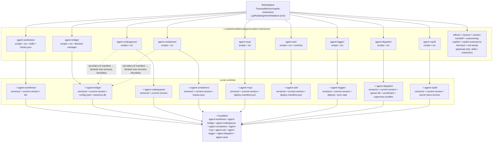
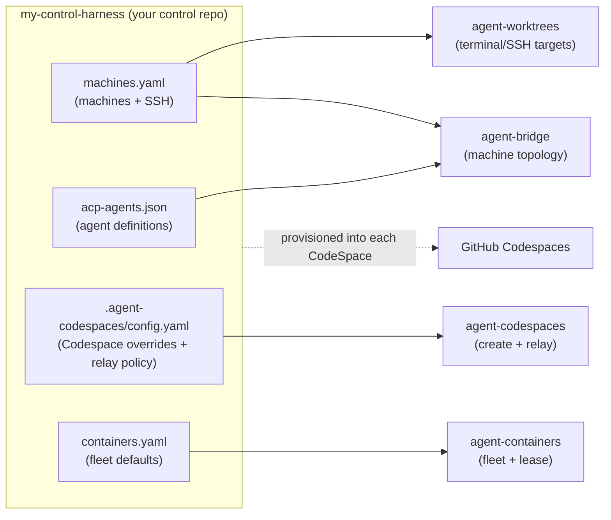
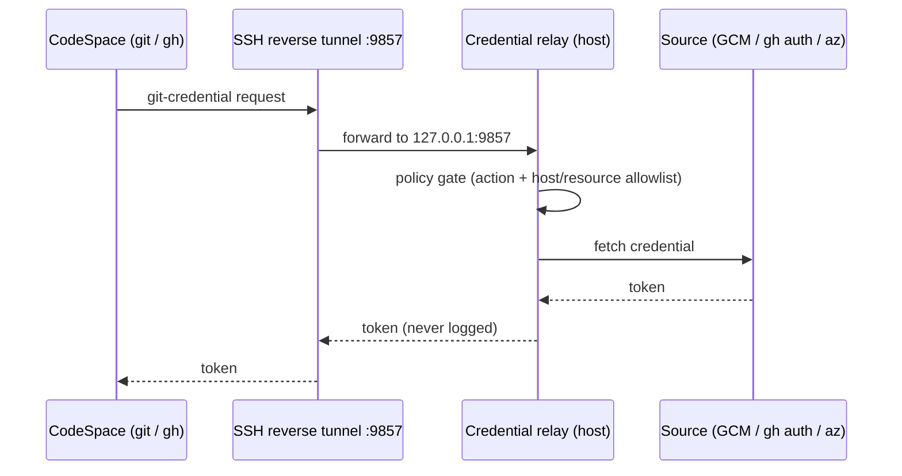
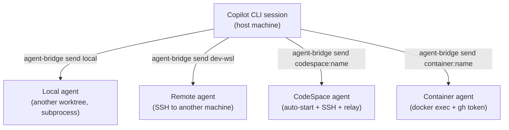

# Architecture Overview

How the eighteen copilot-extensions plugins fit together — install topology,
runtimes, ports, and the credential relay. **Eleven ship a runtime** (a `uv`-built
venv under `~/.agent-*` plus a `~/.local/bin` binstub, deployed by the plugin's
own installer); **seven are payload-only** — `efforts` (skills), `visions`
(skills), `context-handoff` (a session extension), `customizing-copilot`
(skills), `copilot-extensions-harness` (skills), `wsl-setup` (skills), and
`harness-knowledge` (skills) deploy
entirely from the marketplace payload with no installer. For per-plugin
internals, follow the links in each section.

## The plugins

### Runtime plugins (installer-deployed venv + binstub)

| Plugin | Kind | Runtime home | Binstub | Lifecycle |
|--------|------|--------------|---------|-----------|
| [agent-worktrees](../plugins/agent-worktrees/) | Session plugin (skills + `sessionStart` hook) | `~/.agent-worktrees/` | `~/.local/bin/agent-worktrees` + per-project binstubs | Per session (launched by binstub); runtime auto-updates on session start |
| [agent-bridge](../plugins/agent-bridge/) | Persistent HTTP service | `~/.agent-bridge/` | `~/.local/bin/agent-bridge` | Always-on daemon (Windows scheduled task / Linux systemd user unit) |
| [agent-codespaces](../plugins/agent-codespaces/) | CLI + credential relay | `~/.agent-codespaces/` | `~/.local/bin/agent-codespaces` | On-demand CLI; self-registers a `codespace:` namespace **provider** (+ credential relay) with the agent-bridge daemon via a `~/.agent-bridge/providers.d/` manifest — the daemon drives its binstub over a process boundary |
| [agent-containers](../plugins/agent-containers/) | CLI + `container:` provider | `~/.agent-containers/` | `~/.local/bin/agent-containers` | On-demand CLI; self-registers a `container:` namespace **provider** with the agent-bridge daemon via a `~/.agent-bridge/providers.d/` manifest (process-boundary binstub invocation) |
| [agent-mcp](../plugins/agent-mcp/) | Standalone MCP bridge (stdio) | `~/.agent-mcp/` | `~/.local/bin/agent-mcp` | Spawned per-call by an agent's `mcp-servers` entry; no bridge integration |
| [agent-ssh](../plugins/agent-ssh/) | SSH profile emitter + verifier | `~/.agent-ssh/` | `~/.local/bin/agent-ssh` | On-demand CLI; owns the transport-provider contract for SSH profile modules |
| [agent-logger](../plugins/agent-logger/) | Session-logging CLI + writer agent + sync task | `~/.agent-logger/` | `~/.local/bin/agent-logger` | On-demand CLI + a scheduled `session-sync` (Windows task / Linux systemd timer) |
| [agent-dispatch](../plugins/agent-dispatch/) | Task-queue engine + per-host coordinator + CLI/MCP | `~/.agent-dispatch/` | `~/.local/bin/agent-dispatch` | On-demand CLI + optional always-on coordinator and label-gated embody supervisor(s) (Windows tasks / Linux systemd units) |
| [agent-index](../plugins/agent-index/) | Indexing/search service shell | `~/.agent-index/` | `~/.local/bin/agent-index` | Phase 1 always-on service shell (Windows task / Linux systemd user unit); indexing engine arrives in later slices |
| [agent-machines](../plugins/agent-machines/) | Machine-state reconciler CLI | `~/.agent-machines/` | `~/.local/bin/agent-machines` | On-demand CLI (no daemon); reconciled at session launch on its gated machines |
| [agent-vault](../plugins/agent-vault/) | Local secret store: CLI + vault service | `~/.agent-vault/` | `~/.local/bin/agent-vault` | On-demand CLI + a persistent vault daemon (Windows scheduled task / Linux systemd user unit); ships a `vault-askpass` SUDO_ASKPASS helper |

### Payload-only plugins (no installer, no runtime)

| Plugin | Kind | Deployed as | Lifecycle |
|--------|------|-------------|-----------|
| [efforts](../plugins/efforts/) | Planning skills (`planning-efforts`, `efforts-setup`) | Marketplace payload (skills + assets) | Loaded on demand when a skill matches; no runtime to install |
| [visions](../plugins/visions/) | North-star skills (`envisioning`, `visions-setup`) | Marketplace payload (skills + assets) | Loaded on demand when a skill matches; no runtime to install |
| [context-handoff](../plugins/context-handoff/) | Session **extension** + `/handoff` skill | Marketplace payload (`extensions/context-handoff/extension.mjs`) | Auto-discovered from the enabled plugin's `extensions/` dir; no copy to `~/.copilot/extensions/`, no deploy manifest |
| [customizing-copilot](../plugins/customizing-copilot/) | Customization skills (authoring skills, sub-agents, MCP servers, plugins, harnesses, review) | Marketplace payload (skills) | Loaded on demand when a CLI-customization prompt matches; no runtime to install |
| [copilot-extensions-harness](../plugins/copilot-extensions-harness/) | Operator-harness skills (`contributing-to-copilot-extensions`, `diagnosing-copilot-extensions`) | Marketplace payload (skills) | Loaded on demand when a work-on-this-repo prompt matches; no runtime to install |
| [wsl-setup](../plugins/wsl-setup/) | WSL2 setup / troubleshooting skills | Marketplace payload (skills) | Loaded on demand when a WSL-setup prompt matches; no runtime to install |
| [harness-knowledge](../plugins/harness-knowledge/) | Stateless-harness → knowledge-repo binding skill (`binding-knowledge`) | Marketplace payload (skill + configurator script) | Loaded on demand when a harness-setup prompt matches; no runtime to install |

Every runtime plugin is itself a **Python package** — its `src/` package plus
any vendored `libs/` — installed by its own `scripts/install.*` / `scripts/init.*`
with `uv venv` + `uv pip install <plugin_dir>`. `copilot plugin install/update`
only moves the marketplace payload; the runtime venv/binstub/service is deployed
(and updated) by that installer step. The repo uses **`uv`/`uv pip`** throughout
— not `uvx`, `uv tool install`, or `pipx`. The full payload-vs-runtime contract
lives in [install-contract.md](install-contract.md).

## Install topology — marketplace to local paths

Each plugin is vendored by the Copilot CLI into `installed-plugins/`, then its
installer deploys a self-contained runtime under `~/.agent-*`. **At run time
nothing depends on a git checkout of this repo.**

```mermaid
flowchart TB
    MP["Marketplace<br/>ThomasMichon/copilot-extensions<br/>(.github/plugin/marketplace.json)"]
    subgraph IP["~/.copilot/installed-plugins/copilot-extensions/"]
      direction LR
      AW["agent-worktrees/<br/>scripts • src • skills • hooks.json"]
      AB["agent-bridge/<br/>scripts • src • libs/ssh-manager"]
      AC["agent-codespaces/<br/>scripts • src"]
      AN["agent-containers/<br/>scripts • src"]
      AM["agent-mcp/<br/>scripts • src"]
      AS["agent-ssh/<br/>scripts • src • contract"]
      AL["agent-logger/<br/>scripts • src"]
      AD["agent-dispatch/<br/>scripts • src"]
      AV["agent-vault/<br/>scripts • src"]
      PO["efforts/ • visions/ • context-handoff/ • customizing-copilot/ • copilot-extensions-harness/ • wsl-setup/<br/>(payload-only: skills / extension)"]
    end
    subgraph RT["Local runtimes"]
      RW["~/.agent-worktrees/<br/>versions/ • current-version • bin"]
      RB["~/.agent-bridge/<br/>versions/ • current-version • config.yaml • sessions.db"]
      RC["~/.agent-codespaces/<br/>versions/ • current-version"]
      RN["~/.agent-containers/<br/>versions/ • current-version • leases.json"]
      RM["~/.agent-mcp/<br/>versions/ • current-version • deploy-manifest.json"]
      RS["~/.agent-ssh/<br/>versions/ • current-version • deploy-manifest.json"]
      RL["~/.agent-logger/<br/>versions/ • current-version • digests • sync task"]
      RD["~/.agent-dispatch/<br/>versions/ • current-version • queue db • coordinator • supervisor profiles"]
      RV["~/.agent-vault/<br/>versions/ • current-version • secret store service"]
    end
    BIN["~/.local/bin/<br/>agent-worktrees • agent-bridge • agent-codespaces • agent-containers • agent-mcp • agent-ssh • agent-logger • agent-dispatch • agent-vault"]
    MP --> AW --> RW
    MP --> AB --> RB
    MP --> AC --> RC
    MP --> AN --> RN
    MP --> AM --> RM
    MP --> AS --> RS
    MP --> AL --> RL
    MP --> AD --> RD
    MP --> AV --> RV
    MP --> PO
    RW --> BIN
    RB --> BIN
    RC --> BIN
    RN --> BIN
    RM --> BIN
    RL --> BIN
    RD --> BIN
    RV --> BIN
    AC -.->|providers.d/ manifest → binstub over process boundary| RB
    AN -.->|providers.d/ manifest → binstub over process boundary| RB
```

> The `PO` node — `efforts`, `visions`, `context-handoff`, `customizing-copilot`,
> `copilot-extensions-harness`, and `wsl-setup` — deploys entirely from the
> marketplace payload — no installer, no `~/.agent-*` runtime, no binstub.

Key rule: the **agent-codespaces and agent-containers binstubs are owned by
their own runtimes** (`~/.agent-codespaces`, `~/.agent-containers`). agent-bridge
sources their `codespace:` / `container:` namespaces from a **filesystem provider
registry** — it does **not** import their packages. Each provider drops a small
JSON manifest into `~/.agent-bridge/providers.d/<name>.json` from its own
`sessionStart` bootstrap hook (carrying the namespace and an **absolute** binstub
command), and the daemon scans that directory and drives the provider's binstub
**over a process boundary** (`<command> namespace-list` / `namespace-resolve …`).
The daemon runs from its own isolated versioned venv where a provider package is
neither importable nor on `PATH`, so this seam never depends on importing the
provider — a malformed or missing manifest is simply skipped with a warning
(discovery never raises). This keeps one canonical CLI per plugin and avoids
version skew. agent-mcp is standalone: no bridge integration, no resolver —
agents invoke its binstub directly.

## Ports

Steady-state, **a service adds zero fixed listening ports**: it binds an
OS-assigned ephemeral port and advertises it through discovery, so the table
below is a shrinking list of *legacy fixed* endpoints, not a contract to
maintain (dotfiles #694).

| Port | Owner | Purpose |
|------|-------|---------|
| **dynamic** (ephemeral) | agent-bridge daemon | HTTP API the CLI talks to. Binds an OS-assigned port and publishes it to the routing table (`active.json`); clients resolve it there — `agent-bridge status` reads the live port. The former fixed **9280/9281** (Windows/WSL) is retired as a default; a positive `port:` in `config.yaml` (or `--port`) still pins one, and `9280` remains only a last-resort client fallback. |
| **9281** | agent-bridge elevated sub-daemon | Fixed loopback port for the Windows admin sub-daemon (`elevated.py` `ELEVATED_PORT`), reached via `acp-connect ws://127.0.0.1:9281/...`. Not yet migrated to discovery. |
| **9857** | agent-codespaces credential relay | TCP server the CodeSpace reaches over an SSH reverse tunnel (`-R 9857`) to fetch git/GitHub/Azure credentials. Starts with the bridge service. Not yet migrated to discovery (the CodeSpace-side path already uses live-port discovery; the host bind still targets 9857). |

## Agent plugins vs harness plugins — and two senses of "harness"

The word **harness** lands in two unrelated places; keep them apart:

1. **A harness _plugin_** — a payload-only `<repo>-harness` plugin whose skills
   teach an agent how to work *on one specific repo* (contribute, deploy,
   diagnose). `copilot-extensions-harness` is the reference implementation:
   enable it in a control repo instead of hand-writing a per-repo narrative.
   Authoring one is the **`authoring-harness-plugins`** skill's job.
2. **A control-_harness_ repo** — *your own* control-plane repo (a dotfiles-style
   hub) that drives Copilot sessions across many repos and machines. Building one
   is the **`building-harnesses`** skill + the
   [harness runbook](harness-runbook.md); its config lives in
   [§ The control-harness repo](#the-control-harness-repo) below.

Neither is an **agent / runtime plugin** — the `agent-*` plugins
(agent-worktrees, agent-bridge, agent-mcp, …) that actually *do* work: isolate
worktrees, bridge messages, wrap MCP servers. In the patterns vocabulary those
are **runtime CLI** or **runtime service** shapes, whereas both a
`<repo>-harness` plugin and the planning/authoring plugins (efforts, visions,
customizing-copilot) are **payload-only**. The full taxonomy is
[docs/patterns § Plugin shapes](patterns/README.md#plugin-shapes).

## The control-harness repo

A teammate's own repo (a dotfiles-style hub, `my-control-harness` in examples)
is the single source of truth the mesh plugins read from. Where each config file
belongs — in the repo (committed) vs machine-local (`~/`) — is laid out in
[Configuration — In the Repo vs On the Machine](configuration.md).

```mermaid
flowchart LR
    subgraph Repo["my-control-harness (your control repo)"]
      MY["machines.yaml<br/>(machines + SSH)"]
      AG["acp-agents.json<br/>(agent definitions)"]
      CY[".agent-codespaces/config.yaml<br/>(Codespace overrides + relay policy)"]
      CN["containers.yaml<br/>(fleet defaults)"]
    end
    MY --> WT["agent-worktrees<br/>(terminal/SSH targets)"]
    MY --> BR["agent-bridge<br/>(machine topology)"]
    AG --> BR
    CY --> CSp["agent-codespaces<br/>(create + relay)"]
    CN --> CTp["agent-containers<br/>(fleet + lease)"]
    Repo -.->|provisioned into each CodeSpace| GH["GitHub Codespaces"]
```

- `agent-worktrees register` → project binstub + worktree root.
- `agent-bridge config adopt` → a topology profile pointing at `machines.yaml`
  + `acp-agents.json`.
- `agent-codespaces config adopt` → registers a repo that carries a
  supplementary `.agent-codespaces/config.yaml` so it is read live on every
  operation. **Most repos need no config** — machine/location defaults, the
  `/workspaces/<basename>` checkout, and the git-credential relay are all
  convention-derived; adopt only a repo that deviates.
- `agent-containers` reads `containers.yaml` (resolved via
  `$AGENT_CONTAINERS_CONFIG`, `./containers.yaml`, or
  `~/.agent-containers/containers.yaml`) — keep it in the control repo to share
  fleet defaults.

> agent-mcp is **not** wired to the control repo — its bridge configs are
> per-agent files: preferably **in-repo** (`--config .github/agents/<name>.mcp.yaml`)
> for repo-scoped agents, or **user-global** under `~/.agent-mcp/bridges/<name>`
> for personal/cross-repo MCPs.

See [machine-config](../plugins/agent-bridge/docs/machine-config.md) for the
file formats and [codespaces-setup](../plugins/agent-codespaces/skills/codespaces-setup/SKILL.md)
for `.agent-codespaces/config.yaml`.

## Credential relay

The relay lets a CodeSpace authenticate to GitHub and Azure DevOps using **your
host's** credentials — no PATs stored in the CodeSpace. All requests pass a
policy gate (action allowlist + per-source host/resource allowlists).

```mermaid
sequenceDiagram
    participant Space as CodeSpace (git / gh)
    participant Tunnel as SSH reverse tunnel :9857
    participant Relay as Credential relay (host)
    participant Src as Source (GCM / gh auth / az)
    Space->>Tunnel: git-credential request
    Tunnel->>Relay: forward to 127.0.0.1:9857
    Relay->>Relay: policy gate (action + host/resource allowlist)
    Relay->>Src: fetch credential
    Src-->>Relay: token
    Relay-->>Tunnel: token (never logged)
    Tunnel-->>Space: token
```

| Source | Action | Backed by | Default |
|--------|--------|-----------|---------|
| `git-credential` | `get`/`store`/`erase` | local Git Credential Manager | on |
| `gh-auth` | `get-github-token` | `gh auth token` | on |
| `az-login` | `get-azure-token` | `az account get-access-token` | **off** (high-trust; opt-in) |

## Communication paths

```mermaid
flowchart TB
    A["Copilot CLI session<br/>(host machine)"]
    A -->|"agent-bridge send local"| L["Local agent<br/>(another worktree, subprocess)"]
    A -->|"agent-bridge send dev-wsl"| R["Remote agent<br/>(SSH to another machine)"]
    A -->|"agent-bridge send codespace:name"| C["CodeSpace agent<br/>(auto-start + SSH + relay)"]
    A -->|"agent-bridge send container:name"| N["Container agent<br/>(docker exec + gh token)"]
```

- **Local** — no SSH; the bridge spawns a subprocess (optionally in a fresh
  worktree via the agent's `project`).
- **Remote** — SSH to a machine declared in `machines.yaml` with
  `ssh.ready: true`.
- **CodeSpace** — agent-codespaces resolves `codespace:<name>` (by raw **or**
  friendly/display name; the `codespace:` prefix is optional), auto-starts a
  Shutdown CodeSpace, opens SSH with the relay tunnel, and the bridge spawns
  `copilot --acp` inside it.
- **Container** — agent-containers resolves `container:<name>` to a leased local
  dev container, runs `copilot --acp` over `docker exec`, and forwards the host
  `gh auth token` (as `GH_TOKEN`) so the in-container agent is authenticated.

> **Note:** agent-mcp has no `agent-bridge send` path — it is not an inter-agent
> transport. It is wrapped directly by an agent's `mcp-servers` config to expose
> an authenticated upstream MCP server over local stdio.

## Agent-dispatch queue + supervisors

`agent-dispatch` supplies the portable queue/lease authority agents coordinate
through: a per-host loopback coordinator (`agent-dispatch serve`), a CLI and MCP
surface, SSE events, and optional always-on **embody supervisors** that turn
queued, label-gated tasks into autonomous bodies. The primary supervisor reads
`~/.agent-dispatch/supervisor.env`; additional named profiles under
`~/.agent-dispatch/supervisors/<name>.env` install as independent
`agent-dispatch-supervisor-<name>` units/tasks using the same env schema, while
the primary `agent-dispatch-supervisor` remains unchanged.

By default a supervisor body is a CLI/mux `agent-worktrees embody` session on
the supervisor host. `--headless-label L` routes selected local labels to a
headless agent-bridge ACP body instead. In fleet mode,
`agent-dispatch supervise --pool host-a,host-b [--origin <alias>]` keeps the
reservation and task lease on the origin coordinator while spawning only the body
on the first live pool host; the default fleet body is still CLI/mux, and
`--headless` switches the whole fleet to headless agent-bridge ACP sessions on
the pool host (`agent-bridge create <agent> "<fleet seed>" --no-wait`). Headless
fleet bodies record no worktree handle; bounded sweeps settle their reservation
when the task reaches a terminal state. Details live in
[agent-dispatch spawn supervisor](../plugins/agent-dispatch/docs/spawn-supervisor.md).

## Resource obligations & accountability

A worktree **answers for every resource it allocated before it may finalize**.
Anything a worker brings into being on the harness's behalf — a cross-repo
worktree, a borrowed CodeSpace or container, a bridge session — is an
**obligation** it carries until that resource is **closed out**. `finalize` is
the join point where those obligations are asserted clear, so finalizing never
silently orphans a half-finished CodeSpace, an un-merged cross-repo branch, or a
bridge session left mid-flight. (Effort: `resource-obligation-settlement`;
umbrella dotfiles#1081; parent `git-ref-resource-leases`.)

### Disposition — the lien on each outbound claim
Every outbound resource in a worktree's claim ledger
(`agent_worktrees.tracking.ResourceClaim`) carries a **disposition** — the three
values live in `agent_worktrees.obligations`:

- **`active`** — the resource still carries live/unsettled work. **Blocks
  finalize.** A missing/unknown value normalizes to `active` (adoption-safe: an
  un-annotated obligation stays conservatively blocking).
- **`at-rest`** — the *work* is safe (merged / off-box / itself finalized); the
  resource may persist. **Does not block.**
- **`released`** — the *claim* is torn down (its lease tombstoned).

The key decoupling: **`at-rest` is a property of the _resource_; `released` is a
property of the _claim_.** They separate — a CodeSpace can go `at-rest` (work
safe) and have its claim `released` (freeing it for the next borrower) **without
being deleted**. For a leaseable resource the disposition also rides the lease
record's `context` map under the `disposition` key (the store already round-trips
`context`), so it is **cross-machine visible with no store schema change** — the
local ledger is the owner's authority, the lease is the cross-machine mirror.

### The finalize gate (enforcing by default)
`finalize.validate_and_finalize` runs an obligation gate **before any destructive
step** (so a blocked finalize leaves the worktree intact). It reads the **local
ledger** (`record.resources`) for `is_unsettled` (active) claims — a cheap,
local, **no-traversal** balance check. `obligations.gate_mode()` resolves
`AGENT_WORKTREES_OBLIGATION_GATE ∈ {off, warn, block}`, default **block**:

- **`block`** (default) — refuse (return False) while any obligation is
  unsettled, unless `--abandon`, which proceeds and **re-homes** the obligations
  via the `release_all_resources` cascade (never silently drops).
- **`warn`** — surface unsettled obligations but proceed (the pre-Phase-4
  behavior; an operator can opt back into it). A value the operator *set* but we
  don't recognize also degrades here, so a typo never enforces.
- **`off`** — skip.

### Incremental settlement — the recursion collapse
The cost of proving a footprint safe is paid **continuously**, at each resource's
own close-out, not in a recursive walk at finalize. Each resource flips its
**own** disposition when it reaches its close-out; finalize then trusts the
recorded verdict. This is reference counting on a cross-resource scale — the
recursion **collapses into local checks**.

- **cross-repo worktree:** the child's `finalize`
  (`finalize._settle_parent_obligation`) flips the claim its **parent** holds on
  it to `at-rest` (same-machine parent resolved via the child's
  `owner_claim_ref` → `project_dir(project)/worktrees/…`; a cross-machine parent
  defers to the lease mirror / reclaim sweep). The parent's own finalize gate
  then stops treating the child as unsettled **without re-deriving its state**.
- **CodeSpace / container:** cleanliness is stamped on ssh disconnect / heartbeat
  (see below); finalize reads the stamp. On a clean disconnect agent-codespaces
  also **mirrors the disposition onto the CodeSpace's exclusion lease**
  (`coordination.mirror_disposition` → `lease renew codespace <name> --token …
  --disposition at-rest`), so the settled verdict is visible **cross-machine** on
  the shared lease — the source of truth the reclaim sweep reads to settle a
  stale claim on *another* machine (or one a missed-settle left `active` locally).
- **bridge:** flips when the bridge worktree is driven to final.

`tracking.settle_resource_claim(record, ref, disposition)` is the primitive every
hook calls; `agent-worktrees claims {add,settle,release}` is the operator/hook
CLI over the ledger CRUD. `claims add --owner-ref <machine/project/worktree_id>`
journals onto a **cross-project** owner resolved by qualified ref (not the
caller's cwd) — required for a call-site (e.g. agent-codespaces on CodeSpace
borrow) whose cwd is the daemon's, not the borrowing worktree's.

### CodeSpace at-rest — the cleanliness predicate & probe
A CodeSpace reaches `at-rest` when its *work is safe* (merged or off-box), **not**
when it is deleted. `agent_codespaces.cleanliness` decides this: a **read-only**
`probe_command()` runs inside the CodeSpace over the existing SSH channel and
emits `OBLIGATION_PROBE`/`DIRTY`/`AHEAD`/`UNPUSHED_BRANCHES` markers;
`parse_probe` → `at_rest(gc, in_flight=…)` combines git-cleanliness with
host-side in-flight knowledge. **Conservative by construction:** anything
un-probeable reads as **not** at-rest (never settled blind).

**Spike-corrected behaviors (validated against a real CodeSpace, 2026-08-08):**
the probe scans **every** repo under `/workspaces/*` (a borrowed CodeSpace holds
both the scaffold and the actual work repo — unpushed work in *any* keeps it
unsafe), and detects unpushed work with **`git rev-list --count HEAD --not
--remotes`** (commits reachable from HEAD that exist on **no remote**) rather than
`@{u}..HEAD`, which reads 0 on a no-upstream branch (a common CodeSpace state)
and would falsely read clean. The workspace glob must **not** be `shlex.quote`d,
or the shell treats `*` literally and the probe finds no repo.

### Never-wedge safety net
A crashed holder that never settles must not freeze its parent forever. The
**reclaim sweep** (`agent_worktrees.sweep`) may flip an `active` obligation to
**`abandoned`** when the holder is provably gone **and** the resource provably
safe — GC as the complement to refcounting. It may **only** flip to `abandoned`;
it never fabricates `at-rest` (that is strictly the resource's own verdict), and
every unknown is spare (an unconfirmed holder or unproven-safe resource is never
reclaimed). Its verdicts are per-kind:

- **worktree** — same-machine: the child's record is gone/terminal (**gone**) and
  its work already landed upstream (**safe**), via `claimant` liveness + a
  squash-aware branch-merged check.
- **leaseable (codespace / container)** — read the **disposition mirror** off the
  shared exclusion lease (`obligations.from_context`): a settled disposition
  (`at-rest`/`released`/`abandoned`) proves the obligation dischargeable. This is
  the **cross-machine** path *and* the missed-settle path (a bridge-driven box
  that never ran `agent-codespaces ssh`, or a crash after a clean disconnect) —
  the shared lease is the single source of truth, so any machine's sweep reclaims
  its own stale claim.

The sweep runs three ways: **automatically at finalize** (`sweep.self_heal` — the
gate self-heals a provably-gone+safe blocking claim before it can wedge), on
demand via **`agent-worktrees claims sweep [--apply]`** (dry-run by default), and
implicitly whenever finalize re-evaluates the gate.

**`--abandon` re-homes, never drops.** A `finalize --abandon` releases the
worktree's still-unsettled obligations, but each is first written to a durable
per-project **orphanage** (`~/.<project>/orphaned-obligations.yaml`) with
provenance, so the resource it named (an orphaned CodeSpace, a cross-repo
worktree) is recorded rather than lost. **`agent-worktrees claims orphans`** lists
it; **`agent-worktrees claims cleanup [--apply]`** is the acting consumer that
reclaims the orphaned resource (deletes the CodeSpace via `agent-codespaces
delete`, finalizes the cross-repo worktree) and drops the settled entry —
same-machine only, dry-run by default, best-effort (a failed reclaim is retained
for a retry). *(Phase 4–6 complete — the gate default is `block`, enforcing
accountability; `warn`/`off` relax it. Effort `resource-obligation-settlement`
closed; umbrella dotfiles#1081.)*

## Where to go next

- [Rollout readiness plan](plans/rollout-readiness.md) · [Fresh dev box validation](plans/fresh-devbox-validation.md)
- agent-worktrees [architecture](../plugins/agent-worktrees/docs/architecture.md) · [CLI reference](../plugins/agent-worktrees/docs/cli-reference.md)
- agent-bridge [architecture](../plugins/agent-bridge/docs/architecture.md) · [machine-config](../plugins/agent-bridge/docs/machine-config.md)
- agent-codespaces [README](../plugins/agent-codespaces/README.md) · [lifecycle skill](../plugins/agent-codespaces/skills/codespaces-lifecycle/SKILL.md)
- agent-containers [README](../plugins/agent-containers/README.md) · [containers-fleet skill](../plugins/agent-containers/skills/containers-fleet/SKILL.md)
- agent-mcp [README](../plugins/agent-mcp/README.md) · [agent-mcp skill](../plugins/agent-mcp/skills/agent-mcp/SKILL.md)
- agent-logger [README](../plugins/agent-logger/README.md) · [session-sync-setup skill](../plugins/agent-logger/skills/session-sync-setup/SKILL.md)
- efforts [README](../plugins/efforts/README.md) · [planning-efforts skill](../plugins/efforts/skills/planning-efforts/SKILL.md)
- context-handoff [README](../plugins/context-handoff/README.md) · [context-handoff skill](../plugins/context-handoff/skills/context-handoff/SKILL.md)
- customizing-copilot [README](../plugins/customizing-copilot/README.md) · [authoring-skills](../plugins/customizing-copilot/skills/authoring-skills/SKILL.md) · [defining-subagents](../plugins/customizing-copilot/skills/defining-subagents/SKILL.md) · [registering-mcp-servers](../plugins/customizing-copilot/skills/registering-mcp-servers/SKILL.md) · [installing-plugins](../plugins/customizing-copilot/skills/installing-plugins/SKILL.md)
