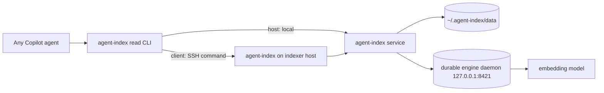

# agent-index architecture

`agent-index` is a runtime service plugin for local, repo-scoped retrieval. This
document describes the code that ships today. Vision documents remain intent;
implemented architecture lives here.

## Implemented state today

The current plugin includes:

- a Python package and `agent-index` CLI;
- a loopback FastAPI service with zdd routing and legacy rendezvous discovery;
- versioned service runtime slots under `~/.agent-index/versions/<version>`;
- durable service data under `~/.agent-index/data/`;
- a durable embedding-engine venv/daemon under `~/.agent-index/engine`;
- source connectors for local git, GitHub issues/PRs, and Azure DevOps work
items/PRs;
- chunkers for code, Markdown, YAML, and fallback text;
- LanceDB content/vector stores, path state, task queue, GC/repair, and
similarity-cluster artifacts;
- CLI (the agent-facing surface), HTTP, and direct MCP query surfaces;
- host/client role routing for read commands over SSH.

That means the old "Phase 1 service shell only" description is stale. Future
work still exists, but indexing and retrieval are present in the shipped code.

## Process model

The service itself is machine-local. Clients do not open a public listener or
run a local indexer daemon; project-aware read commands execute the same
`agent-index` CLI on the designated indexer over SSH. The dynamic service port
stays on the host and is resolved there.

## Install and runtime layout

| Area | Location | Owner |
|------|----------|-------|
| Runtime root | `~/.agent-index` | plugin installer |
| Versioned service slots | `~/.agent-index/versions/<version>` | immutable service runtime |
| Active service marker | `~/.agent-index/current-version` | atomic runtime selection |
| zdd routing table | `~/.agent-index/active.json` | active service endpoint |
| Legacy rendezvous | `~/.agent-index/run/endpoint.json` | fallback diagnostics |
| Durable index/task data | `~/.agent-index/data/` | shared across service versions |
| Durable engine runtime | `~/.agent-index/engine/.venv` | heavy embedding stack |
| Machine config | `~/.agent-index/config.yaml` or `AGENT_INDEX_CONFIG` | role, device, client endpoints |
| Repo config | `<repo>/.agent-index/config.yaml` | indexer designation and corpus scopes |

The installer follows the repo's durable-vs-versioned runtime pattern: service
code is versioned and swappable; index data and queued work are durable and
shared. See `../../../docs/patterns/durable-vs-versioned-runtime.md`.

## Lifecycle and supervision

The default lifecycle is user-mode and session-start-assisted:

1. `bootstrap-check` stamps the installed payload if no runtime exists, putting a
self-provisioning `agent-index` binstub on PATH.
2. First binstub use runs `install.ps1|sh provision` from the stamped snapshot and
builds the current versioned service slot.
3. `ensure-service` runs on session start. On `host` machines it starts or
recovers the user-mode service (and engine when provisioned); on `client`
machines it exits without starting a daemon.
4. `install update` performs an active/passive zdd service cutover when a live
service is healthy. `agent-index deploy --recover` runs breadcrumb recovery for
an interrupted cutover.

Scheduled tasks/systemd units are not the default persistence mechanism. They are
an opt-in advanced tier via the installer `register-tasks` action. This follows
`../../../docs/patterns/service-lifecycle-supervision.md` and
`../../../docs/patterns/graceful-daemon-cutover.md`.

## Service HTTP surface

The service binds `AGENT_INDEX_HOST` (default `127.0.0.1`) and
`AGENT_INDEX_PORT` (default `0`, an OS-assigned ephemeral port). It exposes:

| Endpoint | Meaning |
|----------|---------|
| `GET /health` | `{status: "ok"}` or `{status: "draining"}` |
| `GET /status` | plugin/version, drain state, index counts/sources, indexing runner state |
| `GET /search` | semantic + lexical search; degraded JSON if unavailable |
| `GET /similar` | nearest neighbours for an indexed chunk |
| `GET /clusters` | near-duplicate cluster artifact |
| `POST /reindex` | enqueue background indexing unless draining/deps missing |
| `POST /drain`, `/undrain` | zdd cutover drain gates |
| `POST /shutdown` | service shutdown used by CLI/cutover |
| `POST /adopt-relay` | compatibility stub; returns no relay |

Endpoint discovery is local: zdd `active.json` first, then legacy rendezvous.
See `../../../docs/patterns/local-endpoint-discovery.md`.

## CLI surface

Public CLI verbs are implemented in `src/agent_index/__main__.py`:

- `start` / `serve`, `stop`, `status`, `version`
- `deploy [--recover]` for active/passive cutover
- `index [--source S] [--full]`
- `search <query> [--source S] [--language L] [--repo R] [--limit N] [--json]`
- `similar <chunk_id> [--limit N] [--source S]`
- `clusters [--source S] [--bucket B] [--model M] [--exact-dupes-only] [--limit N]`
- `mcp` for the direct FastMCP HTTP-client toolset
- `engine status|start|stop|run`
- `setup`, `role`, and `capability`

`index-worker` is an internal subprocess entry point used by the task runner.

## Indexing pipeline

`agent-index index` and `POST /reindex` use the same durable indexing core:

1. Resolve source specs from `AGENT_INDEX_SOURCES`, grafted `corpus.sources`, or
the default `git` source.
2. Crawl full or incremental changes through the source connector.
3. Chunk files/items.
4. Ensure the configured embedding engine is reachable.
5. Store canonical content and per-model vectors in LanceDB.
6. Reconcile deletions/stale chunks and persist commit markers.
7. Refresh similarity clusters best-effort when clustering is enabled.

Indexing is incremental by default; full reindex is explicit. The task queue is
SQLite/WAL under `~/.agent-index/data/tasks.db`. Service-triggered reindexes run
in detached versioned worker subprocesses, so a service cutover does not kill an
in-flight indexing job; the successor service re-adopts live workers or marks
dead ones interrupted/resumable.

## Sources and corpus config

Registered source prefixes are `git`, `github`, `ado`, and `azure-devops`.

- `git` indexes local tracked files plus commit-history entries. It prefers the
remote default branch when available and falls back to local HEAD/working tree.
- `github:<owner>/<repo>` indexes GitHub issues and pull requests through the
GitHub connector.
- `ado:<org>/<project>` / `azure-devops:<org>/<project>` indexes only the
operator-configured work-item queries and pull-request queries. No query means
that side indexes nothing, by design.

Corpus config is intentionally outside the runtime. For a plain standalone repo,
no agent-worktrees registration is required: running `agent-index index` in the
repo indexes the current git checkout by default. For multi-repo harness use,
`.agent-index/config.yaml` `corpus.sources` is swept from locally adopted
projects via the sibling agent-worktrees registry; machine-local
`~/.agent-index/config.yaml` can add supplemental sources. The session-start
scope-binding hook separately reads the current repo's `.agent-index/config.yaml`
so agents see configured scopes even before making a query.

## Embedding engine and query behavior

The default model profile is `jinaai/jina-embeddings-v2-base-code` on engine
port `8421`. By default:

- `AGENT_INDEX_ENGINE_MODE=external`: the service does not manage the model
process during indexing; the durable engine daemon owns it.
- `AGENT_INDEX_SEARCH_IN_PROCESS=0`: query embedding also goes through the engine
client. If the engine is unreachable, search attempts a lexical/BM25 fallback.
- `agent-index engine start|stop|status|run` manages the durable engine daemon.
- `install.ps1|sh engine-update` is the explicit path that rebuilds/restarts the
heavy engine runtime; normal service updates preserve the warm engine.

Operators can opt into `subprocess`, `systemd`, or `auto` engine modes, or
in-process CPU query embedding, but those are configuration choices rather than
the shipped default.

## Retrieval + MCP surfaces

Retrieval is agent-facing through the **`agent-index` read CLI**, and there is a
separate lower-level MCP surface:

1. **`agent-index` read CLI (the agent path)** — every agent calls
   `agent-index search` / `similar` / `clusters` / `status` **directly**;
   there is no sub-agent and no MCP-tool wrapper. agent-index is a uniform
   retrieval capability every agent may use, so how-to-search guidance is
   delivered by the sessionStart scope-binding hook's `additionalContext` rather
   than by wrapping the tools. The CLI transport handles host/client SSH routing,
   so the same commands work on a host (local) or a client (over SSH).
2. **Direct `agent-index mcp`** — `src/agent_index/mcp_app.py` exposes HTTP-client
   FastMCP tools (`agent_index_search`/`find_similar`/`clusters`/`status`) plus
   `agent_index_reindex`. It resolves `AGENT_INDEX_ENDPOINT` first, then local
   endpoint discovery. This is a lower-level surface for embedding/automation, not
   the agent retrieval path.

## Robustness and fail-loud behavior

Implemented safeguards include:

- versioned service slot activation with completion markers and garbage
collection that protects live PIDs;
- installer self-staging and watchdog bounds to avoid wedging the singleton
plugin payload;
- zdd active/passive service cutover with drain/undrain and breadcrumb recovery;
- durable queue + detached workers for reindex work across cutovers;
- engine reachability checks before vectorization so a source fails loudly rather
than committing unsearchable content;
- degraded JSON responses for unavailable search/cluster/status paths instead of
tracebacks;
- capability-aware embed batch sizing and configurable embed read timeout.

## Planned or not present

- Query-time trust-domain enforcement is not implemented; callers must scope
queries with `source`/`repo` when crossing trust domains.
- Cross-process source locks during a service cutover are not implemented; store
locking is relied on for the narrow overlap window.
- The plugin does not expose a public network listener, gateway, or relay.
- The read-only agent-facing CLI surface does not expose reindexing.
- There is no plugin-local clean-room scenario under `plugins/agent-index`; fresh
install/runtime changes should use the repo-level clean-room framework when
practical.